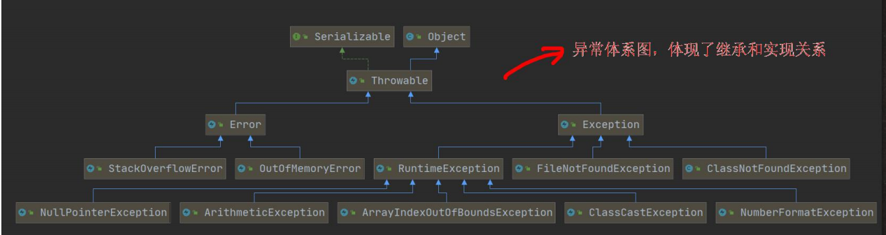
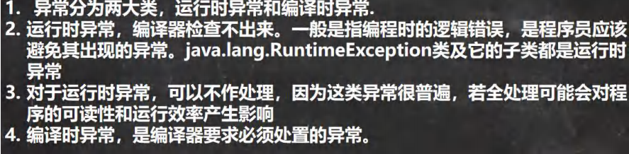

### 异常的概念
两大类异常事件
- error java虚拟机无法解决的严重问题，比如jvm虚拟机内部错误，资源耗尽，StackOverflowError[栈溢出]，OOM[内存溢出]
- Exception 编码错误或者偶然的外在因素导致的一般性问题，可以使用指针对代码进行处理。比如访问不存在的文件，网络连接中断等

```java
Exception分两大类

运行时异常
编译时异常
```
### 异常体系图


小结

### 常见的异常(运行时异常，编译异常)
#### 运行时异常
1. NullPointerException 空指针异常
2. ArithmeticException 数学运算异常
3. ArrayIndexOutOfBoundsException 数组下标越界异常
4. ClassCastException 类型转换异常
5. NumberFormatException 数字格式不正确异常[]

NullPointerException 空指针异常,当应用程序试图在需要对象的地方使用 null 时，抛出该异常

ArithmeticException 数学运算异常,当出现异常的运算条件时，抛出此异常。例如，一个整数“除以零”时，抛出此类的一个实例

ArrayIndexOutOfBoundsException 数组下标越界异常,用非法索引访问数组时抛出的异常。如果索引为负或大于等于数组大小，则该索引为非法索引

ClassCastException 类型转换异常,当试图将对象强制转换为不是实例的子类时，抛出该异常

NumberFormatException 数字格式不正确异常,当应用程序试图将字符串转换成一种数值类型，但该字符串不能转换为适当格式时，抛出该异常 => 使用异常我们
可以确保输入是满足条件数字

#### 编译异常
编译异常是指在编译期间，就必须处理的异常，否则代码不能通过


1. SQLException 操作数据库时，查询表可能发生的异常
2. IOException  操作文件时，发生的异常
3. FileNotFoundException    操作一个不存在的文件时，发生异常
4. CLassNotFoundExcetpion 加载类，而类不存在时，异常
5. EOFException 操作文件，到文件末尾，发生异常
6. IllegalArgumentException 参数异常

### 异常处理概念
异常处理就是当异常发生时，对异常处理的方式
### 异常处理分类
- try-catch-finally
```java
// 在代码中捕获异常，自行处理

try{
    代码/可能有异常
}catch(Exception e){
    捕获到异常
    1. 当异常发生时
    2. 系统将异常封装成Exception 对象e,传递给catch
    3. 得到e对象，自行处理
    4. 如果try没有发生异常，catch代码块，不会执行
}
finally{
    不管try代码块是否异常发生，始终执行finally
    
    通常将关闭，释放资源的代码放在finally
}
```
- throws
```java
将发生的异常抛出，交给调用者(方法)处理，最顶级的处理者是jvm

throws处理机制
1. try-catch-finally和throws二选一
2. 如果程序员，没有显示处理异常，默认是throws
```
#### try-catch-finally细节
- 如果发生了异常，则异常发生后面的代码将不会执行，直接到catch
- 如果没有异常发生，则顺序执行try的代码块，不会进入catch
- 如果希望不管是否发生异常，都执行某段代码，则将其放到finally
- 可以有多个catch，如果 try 代码块有可能有多个异常，可以使用多个 catch 分别捕获不同的异常，相应处理，要求子类异常写在前面，父类异常写在后面

- 可以进行 try-finally 配合使用, 这种用法相当于没有捕获异常，
  因此程序会直接崩掉/退出。应用场景，就是执行一段代码，不管是否发生异常，
  都必须执行某个业务逻辑
#### throws
- throws将发生的异常抛出，交给调用者(方法)处理，最顶级的处理者是jvm

- 在方法声明中用throws语句可以声明抛出异常的列表，throws后面的1异常类型可以是方法中产生的异常类型，也可以是它的父类

throws异常处理细节
- 编译异常必须处理
- 运行时异常，如果程序当中没有处理，默认就是throws
- 子类重写父类的方法时，对抛出异常的规定: 子类重写的方法，所抛出的异常类型要么和父类抛出的异常一致，要么为父类抛出的异常类型的子类型
- 在 throws 过程中，如果有方法 try-catch , 就相当于处理异常，就可以不必 throws

### 自定义异常
当程序当中出现了某些错误，但这些错误没有在Throwable子类当中描述，此时，我们需要自己自定义异常

- 定义类：自定义异常类名，继承Exception或者RuntimeException
- Exception 编译异常
- RuntimeException 运行异常

一般情况下，我们自定义异常是继承 RuntimeException，
即把自定义异常做成 运行时异常，好处时，我们可以使用默认的处理机制
即比较方便
### throw和throws对比
|名称|意义|位置|后面跟的东西|
|---|---|---|---|
|throws|异常处理的一种方式|方法声明处|异常类型|
|throw|手动生成异常对象的关键字|方法体中|异常对象|