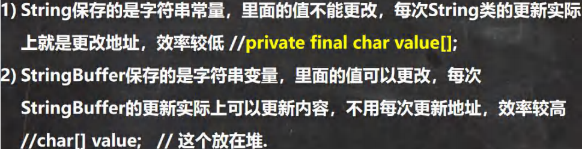
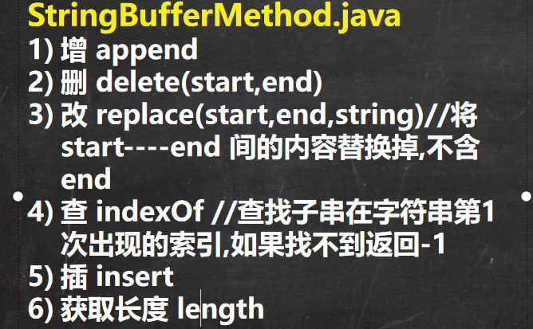
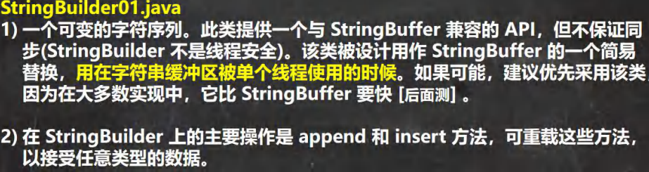
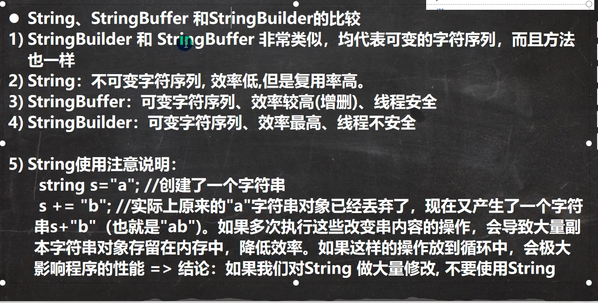
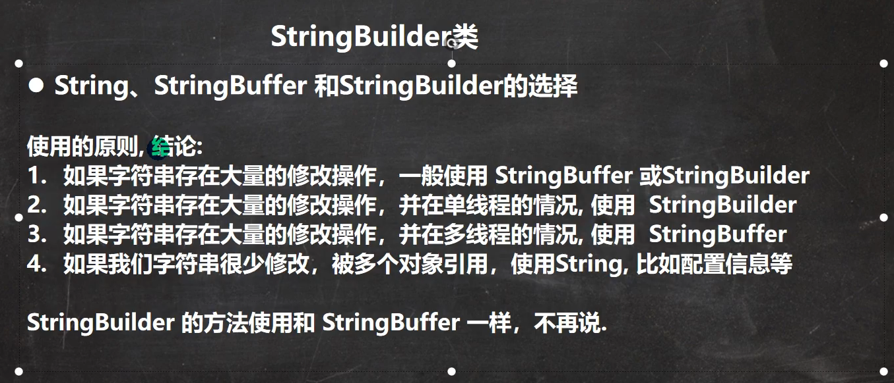

## 常用类
### 包装类(Wrapper)
针对八种基本数据类型对应的引用类型--包装类

有了类的特点，可以调用类当中的方法

|基本数据类型|包装类|
|---|---|
|boolean|Boolean|
|char|Character|
|byte|Byte|
|short|Short|
|int|Integer|
|long| Long|
|float|Float|
|double|Double|

Byte,Short,Integer,Long,Float,Double 的父类是:Number
#### 装箱与拆箱
基本类型---> 包装类型(装箱)

包装类型---> 基本类型(拆箱)

jdk5.0之前，手动装箱和拆箱
```java
// 基本类型---> 包装类型(手动装箱)
int i=10;
Integer i1=new Integer(i);
Integer i2=Integer.valueOf(i);
```

```java
// 包装类型---> 基本类型(手动拆箱)
Integer i=new Integer(10);
int i1=i.intValue();
```
jdk5.0之后，自动装箱和拆箱，自动装箱调用valueOf()方法
```java
// 基本类型---> 包装类型
int i=10;
Integer i1=i;
```
```java
// 包装类型---> 基本类型
Integer i=new Integer(100);
int i1=i;
```

```java
//示例一
Integer i1 = new Integer(127);
Integer i2 = new Integer(127);
System.out.println(i1 == i2);//F

//示例二
Integer i3 = new Integer(128);
Integer i4 = new Integer(128);
System.out.println(i3 == i4);//F

//示例三
Integer i5 = 127;//底层 Integer.valueOf(127)
Integer i6 = 127;//-128~127
System.out.println(i5 == i6); //T

//示例四
Integer i7 = 128;
Integer i8 = 128;
System.out.println(i7 == i8);//F

//示例五
Integer i9 = 127; //Integer.valueOf(127)
Integer i10 = new Integer(127);
System.out.println(i9 == i10);//F

//示例六
Integer i11=127;
int i12=127;
//只有有基本数据类型，判断的是
//值是否相同
System.out.println(i11==i12); //T

//示例七
Integer i13=128;
int i14=128;
System.out.println(i13==i14);//T
```
### String
- String对象用于保存字符串，也就是一组字符序列
- 字符串常量对象使用“ ”，包含起来，例如，“你好”，“12.34”，“abc”
- 字符串的字符使用Unicode字符编码，一个字符占2字节(2Byte)


String c="a"+"b";常量相加看池

String c=a+b;a,b是String对象，对象相加在堆
```java
底层是
StringBuilder sb=new StringBuilder();
sb.append(a);
sb.append(b);
```
```java
String a="hello";
String b="abc";

// 在池
String c="hello"+"abc";

// 在堆
String d=a+b;

// 在堆
String e=a+"abc";

```
String的常用方法

```java
// 1. equals 前面已经讲过了. 比较内容是否相同，区分大小写
// 2.equalsIgnoreCase 忽略大小写的判断内容是否相等
// 3.length 获取字符的个数，字符串的长度
// 4.indexOf 获取字符在字符串对象中第一次出现的索引，索引从 0 开始，如果找不到，返回-1
// 5.lastIndexOf 获取字符在字符串中最后一次出现的索引，索引从 0 开始，如果找不到，返回-1
// 6.substring 截取指定范围的子串
//下面 name.substring(6) 从索引 6 开始截取后面所有的内容
//name.substring(0,5)表示从索引 0 开始截取，截取到索引 5-1=4 位置


// 1.toUpperCase 转换成大写
// 2.toLowerCase
// 3.concat 拼接字符串
// 4.replace 替换字符串中的字符
// s1.replace() 方法执行后，返回的结果才是替换过的. // 注意对 s1 没有任何影响
// 5.split 分割字符串, 对于某些分割字符，我们需要 转义比如 | \\等

// 1. 以 , 为标准对 poem 进行分割 , 返回一个数组
// 2. 在对字符串进行分割时，如果有特殊字符，需要加入 转义符 \

// 6.toCharArray 转换成字符数组
// 7.compareTo 比较两个字符串的大小，如果前者大，
// 则返回正数，后者大，则返回负数，如果相等，返回 0
// 老韩解读
// (1) 如果长度相同，并且每个字符也相同，就返回 0
// (2) 如果长度相同或者不相同，但是在进行比较时，可以区分大小
// 就返回 if (c1 != c2) {
// return c1 - c2;
// }
// (3) 如果前面的部分都相同，就返回 str1.len - str2.len

// 8.format 格式字符串
/* 占位符有:
* %s 字符串 %c 字符 %d 整型 %.2f 浮点型
*
*/
//老韩解读
//1. %s , %d , %.2f %c 称为占位符
//2. 这些占位符由后面变量来替换
//3. %s 表示后面由 字符串来替换
//4. %d 是整数来替换
//5. %.2f 表示使用小数来替换，替换后，只会保留小数点两位, 并且进行四舍五入的处理
//6. %c 使用 char 类型来替换

```
### StringBuffer

- StringBuffer代表可变字符序列，可以对字符串内容进行增删
- 很多方法和String相同，但是StringBuffer是可变长度
- StringBuffer是一共容器


1. StringBuffer 的直接父类 是 AbstractStringBuilder
2. StringBuffer 实现了 Serializable, 即 StringBuffer 的对象可以串行化
3. 在父类中 AbstractStringBuilder 有属性 char[] value,不是 final
该 value 数组存放 字符串内容，引出存放在堆中的
4. StringBuffer 是一个 final 类，不能被继承
5. 因为 StringBuffer 字符内容是存在 char[] value, 所有在变化(增加/删除)
不用每次都更换地址(即不是每次创建新对象)， 所以效率高于 String

#### String Vs StringBuffer

StringBuffer当空间不够时，会扩充空间(另开劈一块地址，且比原先大，将原先的内容拷贝到新地址)，此时才会更新地址

#### StringBuffer常用方法

### StringBuilder


#### String Vs StringBuffer Vs StringBuilder


#### 三者的选择使用

### Math
Math类包含执行数学运算的方法

- abs   绝对值
- pow   求幂
- ceil  向上求整
- floor 向下求整
- round 四舍五入(参数+0.5)
- sprt  开方
- random    求随机数
- max   求两个数最大值
- min   求两个数最小值

### Arrays
Arrays常用方法
- toString
- sort
- sort 定制查询，匿名内部类,重写Comparator的compare()
- binarySearch  二分法查找(必须是排好序的)
```java
int index1 = Arrays.binarySearch(arr, 6);
System.out.println(index1);

// 返回结果 -4

// 找不到返回 -(low+1)
/**
 * int[] arr = {1, 2, 5, 10, 20};
 * 6 在原数组当中并没有
 * 如果arr当中有6，则位置应该如下
 * int[] arr = {1, 2, 5, 6, 10, 20};
 * 6在index=3的位置
 *
 * 因为没有找到6，原数组没有，则返回-(low+1),即-(3+1),-4
 */
```
- copyOf    拷贝
```java
// 数组的拷贝 copyOf
/**
 * 1,Arrays.copyOf(oldArray, oldArray.length);
 * 拷贝整个原数组
 *
 * 2,Arrays.copyOf(oldArray, oldArray.length-1);
 * 拷贝原数组length-1的数组元素
 *
 * 3,Arrays.copyOf(oldArray, oldArray.length+1);
 * 拷贝整个原数组，在此基础上+1，最后一个为默认值，如果是对象，则为null，如果是普通类型，则是默认值0,0.0,false...
 *
 * 4,Arrays.copyOf(oldArray, -1);
 *如果长度是负数，则会抛出异常NegativeArraySizeException(负数，数组大小异常)
 */
```
- fill  填充
- equals    对比两个数组内容是否完全一致
- asList 将一组值转为list

### System
- exit 退出当前程序
- arraycopy 复制数组元素，比较适合底层调用，一般使用Arrays.copyOf
- currentTimeMillens 返回当前时间距离 970-1-1的毫秒数
- gc 运行垃圾回收机制,System.gc();

### BigInteger,BigDecimal
BigInteger 适合保存比较大的整数<br>
BigDecimal 适合保存精度更高的浮点数(小数)

#### 常用方法
在对 BigInteger 进行加减乘除的时候，需要使用对应的方法，不能直接进行 + - * /
- add   加
- subtract  减
- multiply  乘
- divide    除

### Date,Calender,LocalDate...
#### 第一代日期类
- Date:精确到毫秒，代表特定的瞬间
- SimpleDateFormat：格式和解析日期的类
允许经行格式化(日期->文本)，
解析(文本->日期)和规范化

#### 第二代日期类
- Calendar:日历类
- Calendar是一个抽象类，它为特定瞬间与一组日历字段提供相互转换方法

#### 第三代日期类
前两代日期类的不足分析

JDK 1.0当中包含了一个java.util.Date类，但是大多数方法已经在JDK 1.1引入calendar类
之后弃用了，而且calendar类也存在问题
1. 可变性：日期和时间类应该是不可变的
2. 偏移性：Date中的年份从1900开始，而月份都从0开始
3. 格式化：格式化只对Date有用，calendar则不行
4. 此外，它们也不是线程安全，不能处理闰秒(每隔2天，多出1s)


jdk8加入了

- LocalDate(日期)，获取日期字段
- LocakTime(时间), 获取时间字段
- LocalDateTime(时间日期)，获取日期和时间字段
- Instant(时间戳)，提供一系列与Date类转换的方法
```java
Instant--->Date
Date date = Date.from(instant)

Date--->Instant
Instant innstant = date.toInstant()
```
