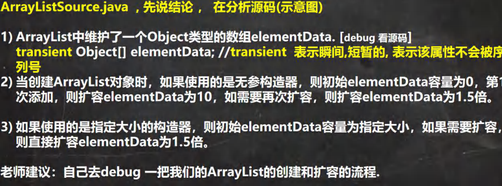

# 集合
集合的理解和好处
- 数组
1. 长度开始时，必须指定，而且一旦指定，不能更改
2. 保存的必须是同一类型的元素
3. 使用数组经行增加、删除元素的代码，比较麻烦

- 集合
1. 可以动态保存任意多个对象，使用比较方法
2. 提供了一些列方便的操作对象的方法：add，remove，set，get等
3. 使用集合增加、删除新元素的代码，简洁

## 集合框架图
```java
//1. 集合主要是两组(单列集合 , 双列集合)
//2. Collection 接口有两个重要的子接口 List Set , 他们的实现子类都是单列集合
//3. Map 接口的实现子类 是双列集合，存放的 K-V
```
List框架图


Map框架图

## Collection接口 特点 方法
### 特点
1. collection实现子类可以存放多个元素，每个元素可以是Object
2. 有些Collection的实现类，可以存放重复元素，有些不可以
3. 有些Collection的实现类，有些是有序的(List)，有些不是有序的(Set)
4. Collection接口没有直接的实现子类，是通过它的子接口Set和List来实现的

### 方法
```java
// Collection 接口常用方法,以实现子类 ArrayList 来演示. CollectionMethod

// add:添加单个元素

// remove:删除指定元素

// contains:查找元素是否存在

// size:获取元素个数

// isEmpty:判断是否为空

// clear:清空

// addAll:添加多个元素

// containsAll:查找多个元素是否都存在

// removeAll：删除多个元素

```
- Collection接口遍历元素方式

1. 使用Iterator(迭代器)
```java
1. Iterator对象称为迭代器，主要用于遍历Collection集合当中的元素
2. 所有实现类Collection接口的集合类都有一个使用Iterator()方法，
用于返回一个实现了Iterator接口的对象，即可以返回一个迭代器
3. Iterator的结构
4. Iterator仅用于遍历集合，Iterator本身并不存放对象
```
2. for循环增强，简化版的iterator，本质一样，只能用于遍历集合或数组
```java
for(元素类型 元素名:集合名/数组名){
    访问元素;
}
//示例
for(Object obj:col){
    System.out.println(obj);
}
```
## Collection接口的子接口: List实现类:ArrayList,LinkedList,Vector
### List

List常用方法
```java
// void add(int index,Object element)在index位置插入一个element

// boolean addAll(int index,Collection elements)在index位置上插入elements所有元素

// Object get(int index)获取index位置上的元素

// int indexOf(Object obj)返回第一次出现该元素的位置

// int lastIndexOf(Object obj)返回最后一次出现该元素的位置

// Object remove(int index)移除指定index位置上面的元素，并返回此元素

// Object set(int index,Object obj)设置指定index位置上面的元素为obj，相当于替换

// List subList(int fromIndex,int toIndex)返回从start到end位置的子集合[fromIndex,toIndex)

```
List三种遍历方法
```java
System.out.println("================iterator遍历====================");
Iterator iterator = list.iterator();
while (iterator.hasNext()) {
    Object next = iterator.next();
    System.out.println(next);
}

System.out.println("=================增强for遍历=====================");
for (Object obj : list) {
    System.out.println(obj);
}

System.out.println("=================普通for循环=====================");
for (int i = 0; i < list.size(); i++) {
    Object obj=list.get(i);
    System.out.println(obj);
}
```
ArrayList注意事项

ArrayList线程不安全，但是效率高

ArrayList的底层操作机制源码分析(重点，难点.)


### Set

## Collection接口的子接口: Set实现类:HashSet,TreeSet,LinkedHashSet

## Map接口 特点 方法 遍历方法

## Map接口的实现类: HashMap,Hashtable,TreeMap,Properties,LinkHashMap等

## Collection工具类的使用