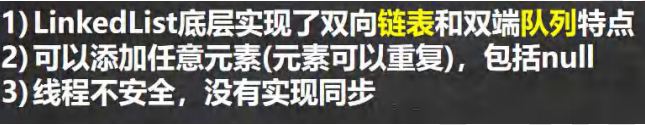

# 集合
集合的理解和好处
- 数组
1. 长度开始时，必须指定，而且一旦指定，不能更改
2. 保存的必须是同一类型的元素
3. 使用数组经行增加、删除元素的代码，比较麻烦

- 集合
1. 可以动态保存任意多个对象，使用比较方法
2. 提供了一些列方便的操作对象的方法：add，remove，set，get等
3. 使用集合增加、删除新元素的代码，简洁

## 集合框架图
```java
//1. 集合主要是两组(单列集合 , 双列集合)
//2. Collection 接口有两个重要的子接口 List Set , 他们的实现子类都是单列集合
//3. Map 接口的实现子类 是双列集合，存放的 K-V
```
List框架图


Map框架图

## Collection接口 特点 方法
### 特点
1. collection实现子类可以存放多个元素，每个元素可以是Object
2. 有些Collection的实现类，可以存放重复元素，有些不可以
3. 有些Collection的实现类，有些是有序的(List)，有些不是有序的(Set)
4. Collection接口没有直接的实现子类，是通过它的子接口Set和List来实现的

### 方法
```java
// Collection 接口常用方法,以实现子类 ArrayList 来演示. CollectionMethod

// add:添加单个元素

// remove:删除指定元素

// contains:查找元素是否存在

// size:获取元素个数

// isEmpty:判断是否为空

// clear:清空

// addAll:添加多个元素

// containsAll:查找多个元素是否都存在

// removeAll：删除多个元素

```
- Collection接口遍历元素方式

1. 使用Iterator(迭代器)
```java
1. Iterator对象称为迭代器，主要用于遍历Collection集合当中的元素
2. 所有实现类Collection接口的集合类都有一个使用Iterator()方法，
用于返回一个实现了Iterator接口的对象，即可以返回一个迭代器
3. Iterator的结构
4. Iterator仅用于遍历集合，Iterator本身并不存放对象
```
2. for循环增强，简化版的iterator，本质一样，只能用于遍历集合或数组
```java
for(元素类型 元素名:集合名/数组名){
    访问元素;
}
//示例
for(Object obj:col){
    System.out.println(obj);
}
```
## Collection接口的子接口: List实现类:ArrayList,LinkedList,Vector
### List

#### List常用方法
```java
// void add(int index,Object element)在index位置插入一个element

// boolean addAll(int index,Collection elements)在index位置上插入elements所有元素

// Object get(int index)获取index位置上的元素

// int indexOf(Object obj)返回第一次出现该元素的位置

// int lastIndexOf(Object obj)返回最后一次出现该元素的位置

// Object remove(int index)移除指定index位置上面的元素，并返回此元素

// Object set(int index,Object obj)设置指定index位置上面的元素为obj，相当于替换

// List subList(int fromIndex,int toIndex)返回从start到end位置的子集合[fromIndex,toIndex)

```
#### List三种遍历方法
```java
System.out.println("================iterator遍历====================");
Iterator iterator = list.iterator();
while (iterator.hasNext()) {
    Object next = iterator.next();
    System.out.println(next);
}

System.out.println("=================增强for遍历=====================");
for (Object obj : list) {
    System.out.println(obj);
}

System.out.println("=================普通for循环=====================");
for (int i = 0; i < list.size(); i++) {
    Object obj=list.get(i);
    System.out.println(obj);
}
```
#### ArrayList

ArrayList线程不安全，但是效率高

ArrayList的底层操作机制源码分析(重点，难点.)


#### Vector


ArrayList Vs Vector

| |底层结构|版本|线程安全(同步) 效率|扩容倍数|
|---|---|---|---|---|
|ArrayList|可变数组Object[]|jdk1.2|不安全，效率高|有参构造器1.5倍。如果是无参，第一次10，从第二次开始按照1.5|
|Vector|可变数组Object[]|jkd1.0|安全，效率不高|有参(指定大小)，每次按照2倍。如果是无参，默认10，满了第二次按照2倍|

#### LinkedList
LinkedList全面说明


LinkedList底层操作机制


ArrayList Vs LinkedList


## Collection接口的子接口: Set实现类:HashSet,TreeSet,LinkedHashSet

### Set


#### Set常用方法
和 List 接口一样, Set 接口也是 Collection 的子接口，因此，常用方法和 Collection 接口一样.

#### Set两种遍历方式


#### HashSet


##### Set接口实现类HashSet


##### Set接口实现类HashSet,底层机制


##### Set接口实现类HashSet,底层扩容机制


#### LinkedHashSet


##### Set接口实现类LinkedHashSet,底层机制


#### TreeSet

## Map接口 特点 方法 遍历方法
### 特点


### 方法
#### 常用方法
```java
 // remove:根据键删除映射关系
map.remove(null);
System.out.println("map=" + map);

// get：根据键获取值
Object val = map.get("鹿晗");
System.out.println("val=" + val);

// size:获取元素个数
System.out.println("k-v=" + map.size());

// isEmpty:判断个数是否为 0
System.out.println(map.isEmpty());

// clear:清除 k-v
map.clear();
System.out.println("map=" + map);

// containsKey:查找键是否存在
System.out.println(map.containsKey("hsp"));
```
#### Map6种遍历方式


MapFor.java

- containsKey:查找键是否存在
- keySet:获取所有的键
- values:获取所有的值
- entrySet:获取所有的关系k-v
```java
public class demo04_MapFor {
    public static void main(String[] args) {
        Map map = new HashMap();
        map.put("邓超", "孙俪");
        map.put("王宝强", "马蓉");
        map.put("宋喆", "马蓉");
        map.put("刘令博", null);
        map.put(null, "刘亦菲");
        map.put("鹿晗", "关晓彤");

        //第一组: 先取出 所有的 Key , 通过 Key 取出对应的 Value
        Set keySet = map.keySet();

        // 1. 增加for
        System.out.println("-----第一种方式-------");
        for (Object key : keySet) {
            System.out.println(key + "-" + map.get(key));
        }

        // 2. 集合迭代器
        System.out.println("-----第二种方式-------");
        Iterator iterator = keySet.iterator();
        while (iterator.hasNext()) {
            Object key = iterator.next();
            System.out.println(key + "-" + map.get(key));
        }


        //第二组: 把所有的 values 取出
        Collection values = map.values();
        //这里可以使用所有的 Collections 使用的遍历方法
        //(1) 增强 for
        System.out.println("---取出所有的 value 增强 for----");
        for (Object value : values) {
            System.out.println("value=" + value);
        }

        //(2) 迭代器
        System.out.println("---取出所有的 value 迭代器----");
        Iterator iterator1 = values.iterator();
        while (iterator1.hasNext()) {
            Object value = iterator1.next();
            System.out.println("value=" + value);
        }

        //第三组: 通过 EntrySet 来获取 k-v
        Set entrySet = map.entrySet(); // EntrySet<Map.Entry<K,V>>
        //(1) 增强 for
        System.out.println("----使用 EntrySet 的 for 增强(第 3 种)----");
        for (Object entry : entrySet) {
            //将 entry 转成 Map.Entry
            Map.Entry m = (Map.Entry) entry;
            System.out.println(m.getKey() + "-" + m.getValue());
        }

        //(2) 迭代器
        System.out.println("----使用 EntrySet 的 迭代器(第 4 种)----");
        Iterator iterator2 = entrySet.iterator();
        while (iterator2.hasNext()) {
            Object entry = iterator2.next();
            //System.out.println(next.getClass());//HashMap$Node -实现-> Map.Entry (getKey,getValue)
            //向下转型 Map.Entry
            Map.Entry m = (Map.Entry) entry;
            System.out.println(m.getKey() + "-" + m.getValue());
        }

    }
}

```

## Map接口的实现类: HashMap,Hashtable,TreeMap,Properties,LinkHashMap等
### Map
#### HashMap
##### HashMap小结


##### HashMap 底层机制及源码剖析

结论

#### TreeMap

#### TreeTable


## Collection工具类的使用