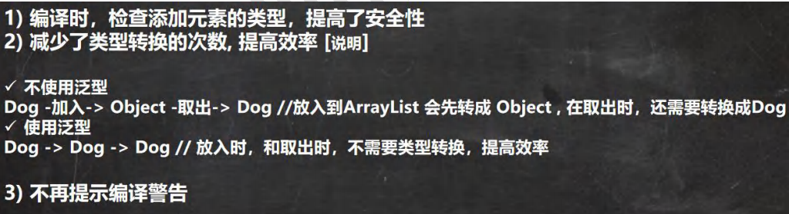
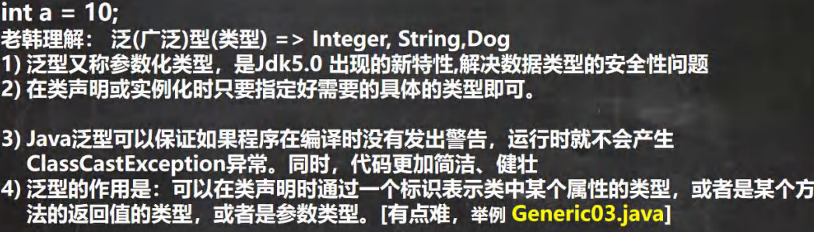
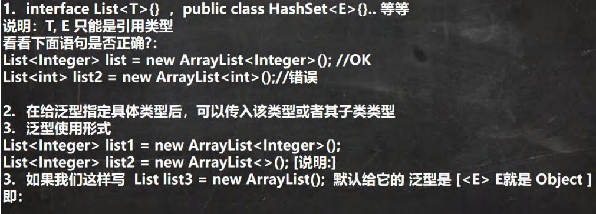
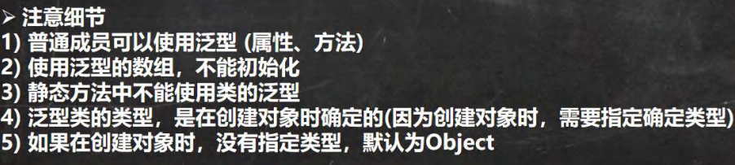
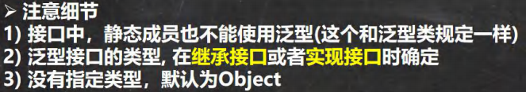
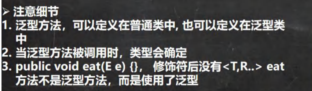
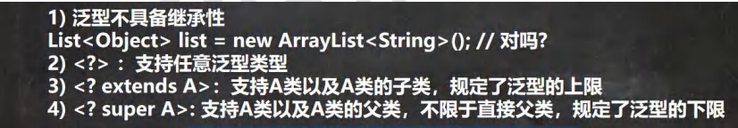

# 泛型
## 泛型的引出
使用传统写法的问题
```java
// 请编写程序，在 ArrayList 中，添加 3 个 Dog 对象
// Dog 对象含有 name 和 age, 并输出 name 和 age (要求使用 getXxx())

ArrayList arrayList = new ArrayList();
arrayList.add(new Dog("dog1", 10));
arrayList.add(new Dog("dog2", 20));
arrayList.add(new Dog("dog3", 30));

//假如我们的程序员，不小心，添加了一只猫
arrayList.add(new Cat("cat1",10));

// 遍历
for (Object o : arrayList) {
    //向下转型 Object ->Dog
    Dog dog = (Dog) o;
    System.out.println(dog.getName() + " " + dog.getAge());
}
```
- 不能对加入集合的数据类型进行约束(不安全)
- 遍历的时候，需要进行类型转换，如果集合当中的数据量较大，对效率有影响

## 泛型的理解和好处


## 泛型的介绍

# 泛型语法
## 泛型的声明
```java
// 比如list，ArrayList
// 1.T,K,V不代表值,而是表示类型
// 2.任意字母都可以，常用T表示,Type的缩写

interface 接口<T>{}

class 类<K,T>{}
```
## 泛型的实例化
```java
// 要在类名后面指定类型参数的值(类型)

List<String> strList= new Arraylist<String>();
Iterator<Customer> iterator = customers.iterator();
```
## 泛型注意事项和细节

# 自定义泛型

## 泛型类
```java
class 类名<T,R...>{
    成员
}

```
### 注意细节
类

## 泛型接口
```java
interface 接口名<T,R...>{
    
}
```
### 注意细节
接口


## 泛型方法
```java
修饰符 <T,R...>返回类型 方法名(参数列表){
    
}
```
### 注意细节
方法

# 泛型继承和通配符
泛型继承和通配符


# Junit
- Junit是一个java语言的单元测试框架


