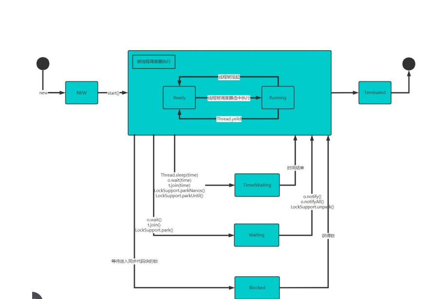

# 线程
## 进程
进程即指运行当中的程序，比如打开正在运行的qq，操作系统会为其分配一定的内存空间<br>
进程是程序的一次执行过程，或者是一个正在执行的程序，是动态的，有自身的产生，存在，消亡的过程
## 线程
线程由进程创建，是进程的一个实体<br>
一个进程可以有多个线程
## 其他概念
- 单线程 同一时刻，只运行执行一个线程
- 多线程 同一时刻，可以执行多个线程
- 并发 同一时刻，多个任务交替执行。单核cpu实现多任务就是并发
- 并行 同一时刻，多个任务同时执行。多核cpu可以实现并行

# 线程的使用
## 线程的两种创建方式
```java
1. 继承Thread类，重写run方法
2. 实现Runnable接口，重写run方法
```
## Thread Vs Runnable


## 线程启动
使用start()
## 线程终止
- 当线程完成任务后，会自动退出
- 通过使用变量来控制run()方法退出的方式，停止线程，即通知方法

# 线程方法
## 常用方法1

## 主要细节

## 常用方法2


# 用户线程和守护线程

# 线程生命周期
## 线程生命周期

## 线程状态转换图

# Synchronized
## 线程同步


## Synchronized

## 分析同步原理

# 互斥锁
## 互斥锁

## 主要细节

# 死锁
多个线程都占用了对方的锁资源，但不肯想让，导致了死锁
# 释放锁
## 释放锁

## 下面操作不会释放锁
