# IO流
# 文件常用操作
## 创建文件3种方式
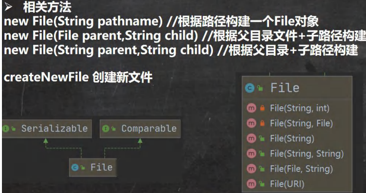
## 常用方法
文件常用方法
- getName
- getAbsolutePath
- getParent
- length    按照字节计算
- exists
- isFile
- isDirectory

目录常用方法
- mkdir() 创建一级目录
- mkdirs() 创建多级目录
- delete() 删除空目录或者文件
# 流
## 流的分类
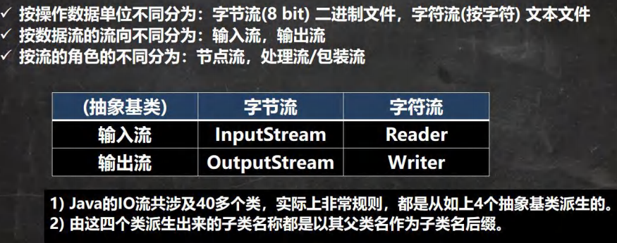
## IO流体系
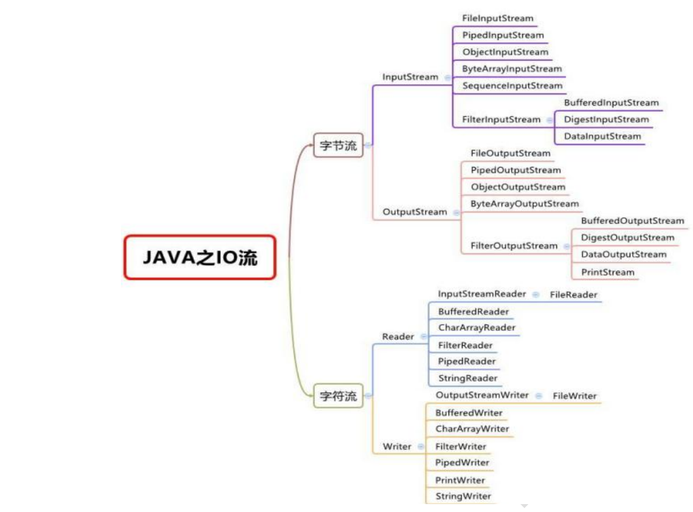

# 字节流
## InputStream OutputStream
### FileInputStream 文件输入流
### FileOutputStream 文件输入流
### BufferedInputStream 缓冲字节输入流
### BufferedOutputStream 缓冲字节输出流
### ObjectInputStream 对象字节输入流
### ObjectOutputStream 对象字节输出流

# 字符流
## Reader Writer
### FileReader
### FileWrite
### BufferedReader
### BufferedWriter 

# 字符流FileReader
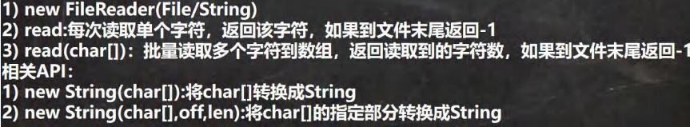

# 字符流FileWrite
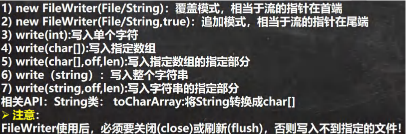

# 节点流和处理流
## 结点流

## 处理流
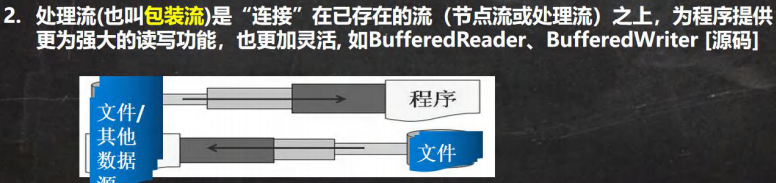
- 性能的提高：主要以增加缓冲的方式来提高输出输入的效率
- 操作的便捷：处理流可能提供一些列便捷的方法来一次
输入输出大批量的数据，使更加灵活方便
## 一览图
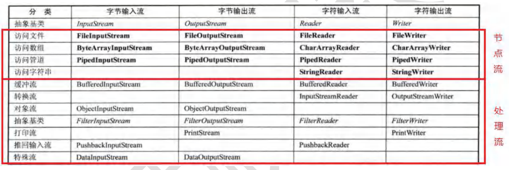 
## 区别和联系
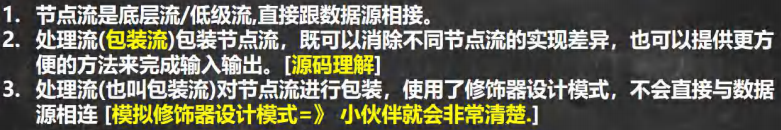

# 对象流 ObjectInputStream ObjectOutputStream
功能：提供了对基本类型或对象类型的序列化和反序列化的方法 
ObjectOutputStream 提供 序列化功能 
ObjectInputStream 提供 反序列化功能 
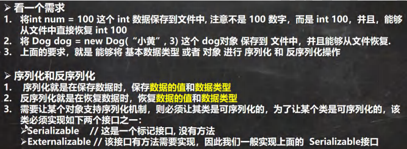
## 序列化和反序列化
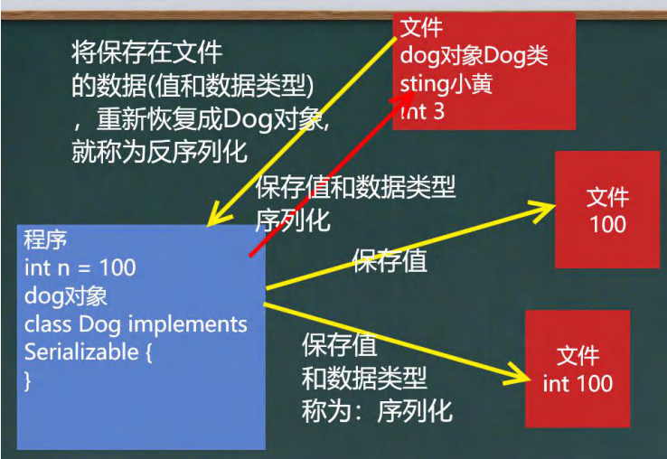
### 注意事项
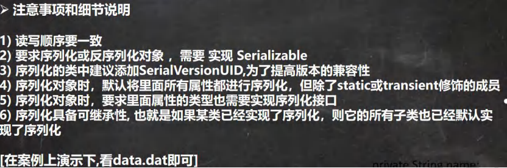
# 标准输入 输出流
| |类型|默认设备|
|---|---|---|
|System.in 标准输入|InputStream|键盘|
|System.out 标准输出|PrintStream|显示器|
# 转换流-InputStreamReader 和 OutputStreamWriter
使用
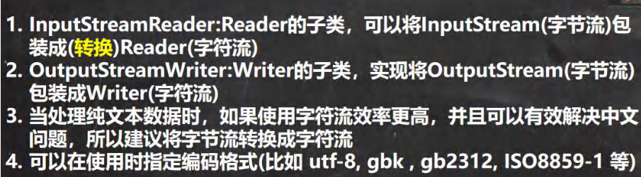

# 打印流 PrintStream 和 PrintWriter
打印流只有输出流
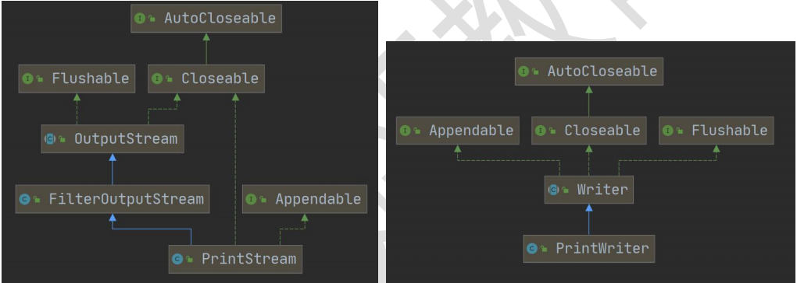

# Properties类
介绍
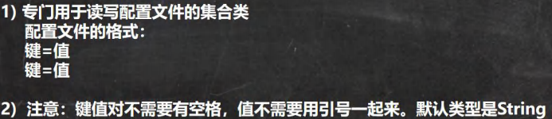
常用方法
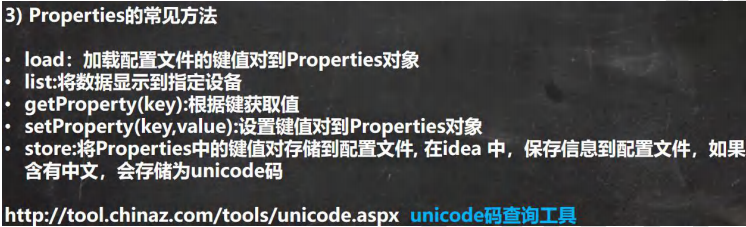