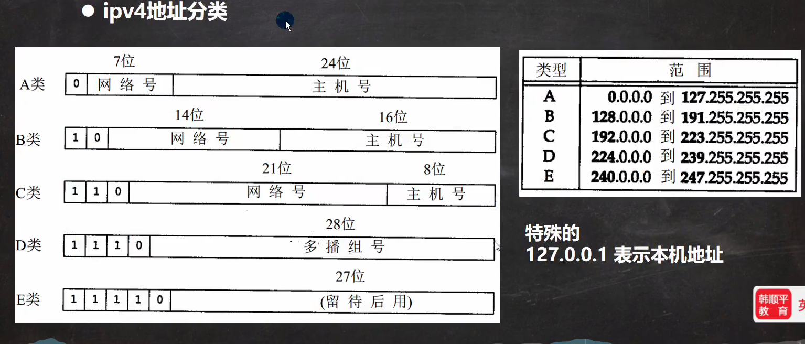
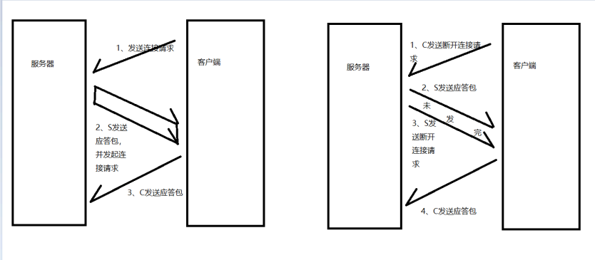
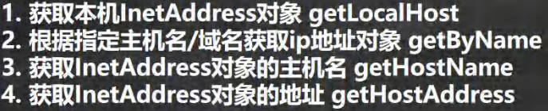
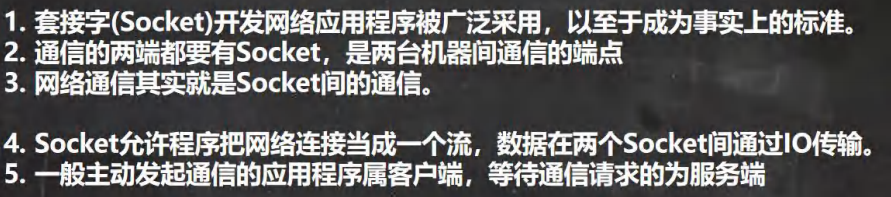
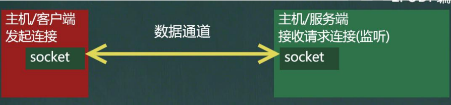
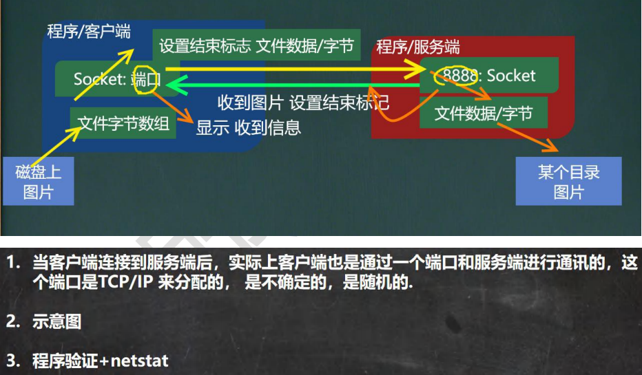
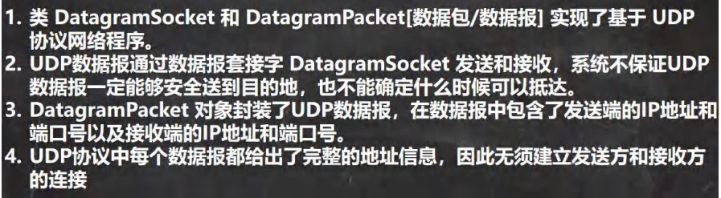
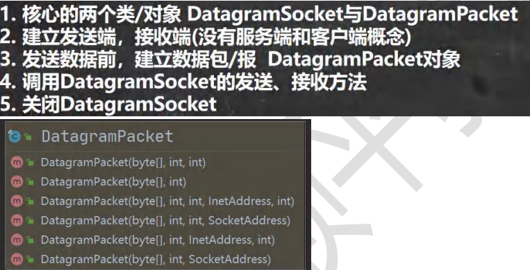

# 网络编程

# Tcp三次握手

# InetAddress类
## 相关方法

# Socket
## Socket

## Socket示意图

# Tcp网络编程
## TCP 网络通讯不为人知的秘密 
客户端需要指定服务端的ip和port，进行通信 
服务端需要指定port，进行通信 
其实，客户端本身也开了一个端口，为了与服务器端通信 

# netstat

# Udp网络编程
## Udp基本介绍

## 基本流程

