# 反射
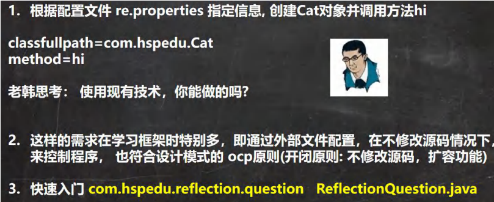
# 反射机制
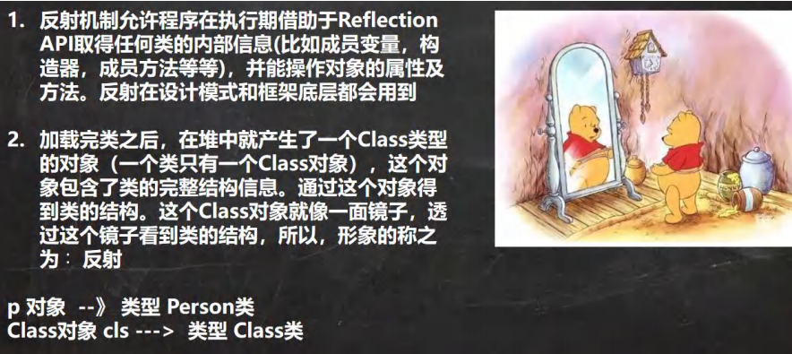
Java 反射机制原理示意图
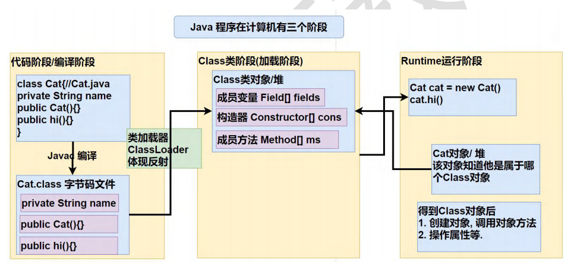
Java 反射机制可以完成
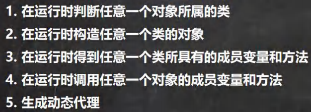
反射相关的主要类
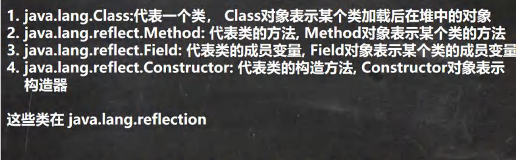
反射优点和缺点
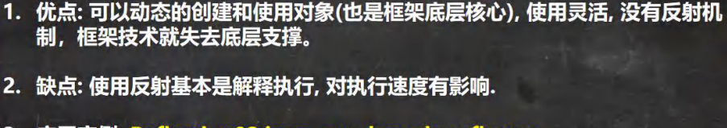
反射调用优化-关闭访问检查
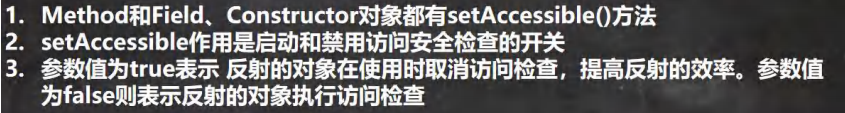

# Class类
基本介绍
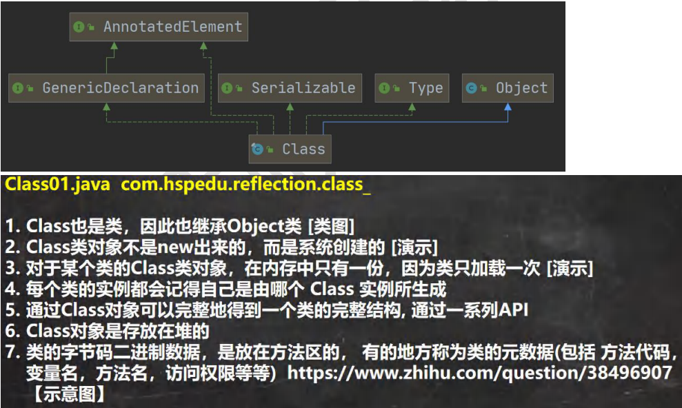
Class 类的常用方法
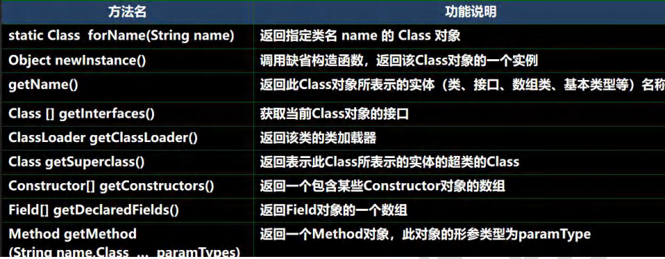
获取 Class 类对象
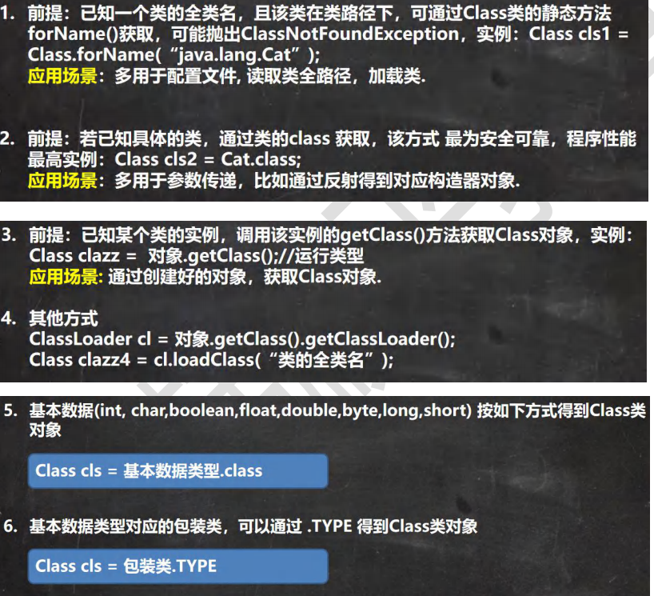
哪些类型有 Class 对象
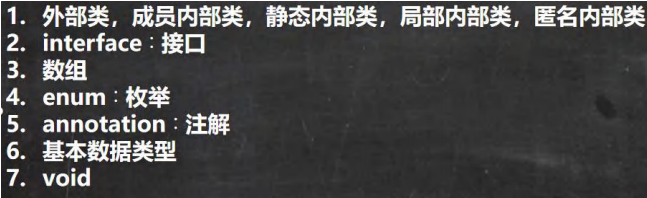
# 类加载
类加载基本介绍
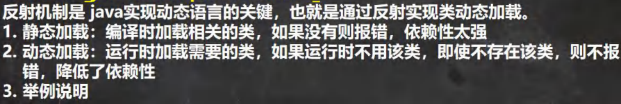
类加载时机
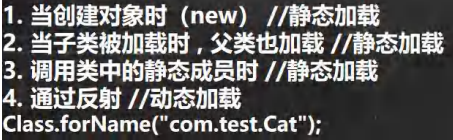
类加载过程图
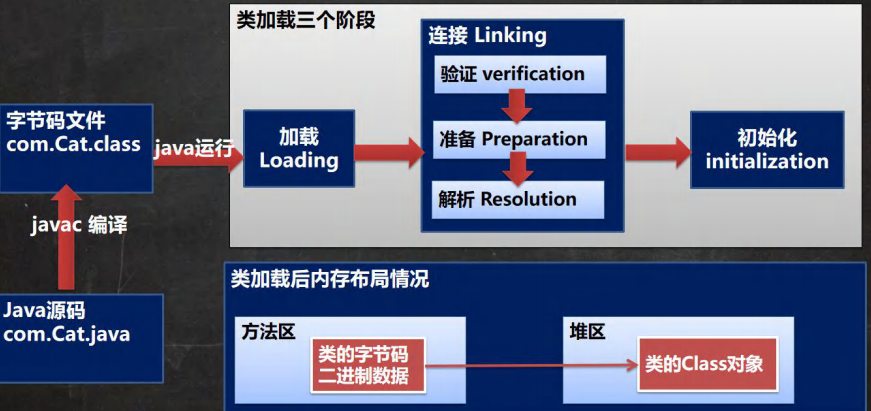
类加载各阶段完成任务

加载阶段
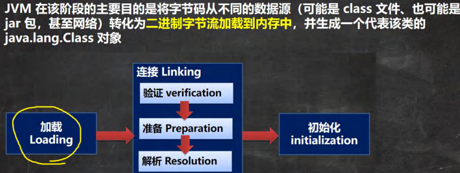
连接阶段-验证
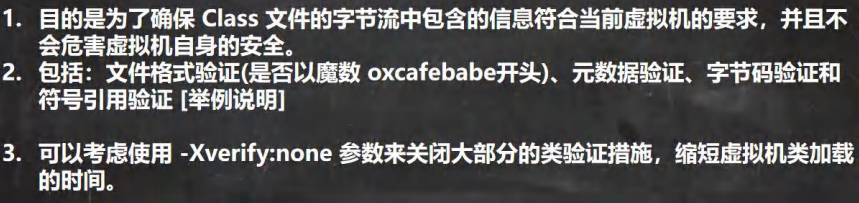
连接阶段-准备

连接阶段-解析
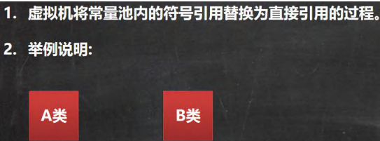
Initialization（初始化)

# 反射获取类的结构信息
## Class
第一组: java.lang.Class 类

## Field
第二组: java.lang.reflect.Field 类
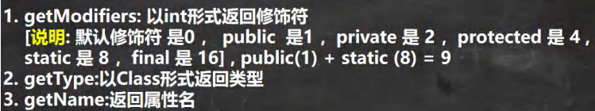
## Method
第三组: java.lang.reflect.Method 类
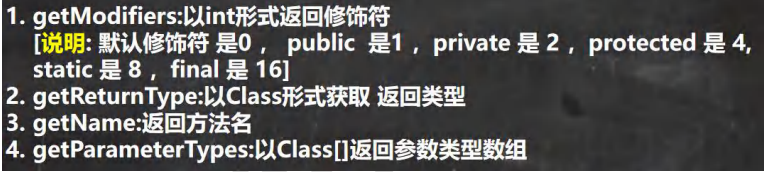
## Constructor
第四组: java.lang.reflect.Constructor 类

# 通过反射创建对象
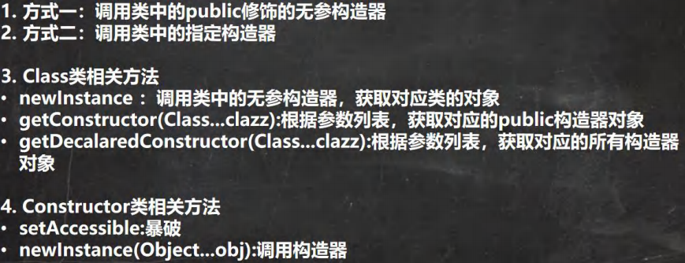
# 通过反射访问类中的成员
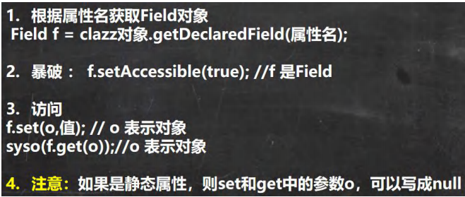
## 访问属性

## 方法方法

# 反射相关类
# 反射调用性能优化
# Class常用类方法