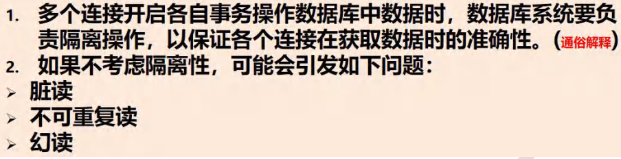

# Mysql
## Mysql启停
启动/停止
```mysql
net stop mysql服务名
net start mysql服务名
```
## MySql连接
客户端连接Mysql命令
```mysql
mysql -u用户名 -p密码
mysql -h 主机ip -p端口 -u 用户名 -p密码
```
## SQL语句分类
- DDL: 数据定义语句(create 表，库)
- DML: 数组操作语句(insert,update,delete)
- DQL: 数据查询语句(select)
- DCl: 数据控制语句(管理数据库:用户权限grant，revoke)
# 数据库
## 创建数据库
```mysql
create database [if not exists] db_name 
character charset_name #默认utf8
collate collation_name #默认utf8_general_ci,不区分大小写

# 校对规则 utf8_bin 区分大小，默认 utf8_general_ci 不区分大小写

```
## 查看，删除数据库
```mysql
show databases;#显示数据库

show create database db_name;#显示数据库创建语句

# 在创建数据库,表的时候，为了规避关键字，可以使用反引号解决 create database 'creatr'
drop databases [if exists] db_name; #删除数据库
```
## 备份，恢复数据库
```mysql
# 备份 在dos下执行
mysqldump -u 用户名 -p -B 数据库1 数据库2 ...数据库n > 路径\\文件名.sql
mysqldump -u 用户名 -p 数据库 表1 表2 ...表n > 路径\\文件名.sql

# 恢复 进入mysql执行
Source 路径\\文件名.sql
```
# 表
## 创建
```mysql
create table table_name(
    field1 datatype,
    field2 datatype,
    field3 datatype
)character set 字符集 collate 校对规则 engine 存储引擎
# 关键字段使用反引号括起来``,避免与mysql关键字冲突
```
## Mysql列类型
- 数值类型
  - 整形
    - tinyint[1字节]
    - smallint[2字节]
    - mediumint[3字节]
    - int[4字节]
    - bigint[8字节]
  - 小数类型
    - float[4字节]
    - double[4字节]
    - decimal[M长度,D小数点][大小不确定]
- 文本类型(字符串类型)
  - char 0-255
  - varchar 0-65536[0-2^16-1]
  - text 0-65535[0-2^16-1]
  - longtext [0-2^32-1]
- 二进制数据类型
  - blob[0-2^16-1]
  - longblod[0-2^32-1]
- 日期类型
  - data[日期 年-月-日]
  - time[时间 时-分-秒]
  - datatime[年-月-日 时:分:秒]
  - timestamp [时间戳]
  - year[年]

### 整型的使用
```mysql
# tinyint -128-127  0-255
# 默认有符号
create table if not exists table3_useInt(
    `id` tinyint
)character set utf8 collate  utf8_general_ci engine innodb;

# 添加unsigned 无符号
create table if not exists table3_useInt(
    `id` tinyint unsigned
)character set utf8 collate  utf8_general_ci engine innodb;

```
### Bit的使用
```mysql
create table if not exists table4_useBit
(
    `num` bit(8) # 8位即1Byte 显示的时候安装2进制
) character set utf8 collate utf8_general_ci engine innodb;
```
### 小数的使用
```mysql
create table if not exists table5
(
    num1 float,
    num2 double,
    num3 decimal(30, 20) # decimal(M,D)M最大65，D最大30，M省略不写，默认10，D默认0
) character set utf8 collate utf8_general_ci engine innodb;

insert into table5 values (88.12345678912345,88.12345678912345,88.12345678912345);

select * from table5;
```
### char和varchar
Row size too large. The maximum row size for the used table type, 
not counting BLOBs, is 65535. This includes storage overhead, 
check the manual. You have to change some columns to TEXT or BLOB<br>
这个错误消息表明你的表格的行大小超出了MySQL的限制，
即默认的最大行大小限制为65535字节（不包括BLOB列），
这包括了列的实际数据以及一些存储开销。

定义了1个varchar(21840),char(4) 行大小最大65535/2(gbk 每个字占2字节)或者65535/3(utf8 每个字占3字节)
21844 >= (65535-3)/3=21844 有1-3个字节记录数据大小,可以存储
```mysql
drop table if exists table7;
create table if not exists table7
(
    `name1` varchar(21840),
    `namw2` char(4) # char(5) 不行，(21840+5) *3 >65535-3[varchar记录数据大小3字节]
)
```
### 日期类型的使用
```mysql
create table if not exists table8_data
(
    `birthday` date,
    `job_time` datetime,
    `login_time` timestamp not null default current_timestamp on update current_timestamp
# login_time 时间戳类型 不为空，默认当前时间戳，更新时 当前时间戳
) character set utf8 collate utf8_general_ci engine innodb;
```

## 修改表 alter table
### 添加列
```mysql
alter table table_name 
ADD COLUMN `new_column1` VARCHAR(255),
ADD COLUMN `new_column2` INT,
ADD COLUMN `new_column3` DATE;
```
### 修改列
```mysql
ALTER TABLE table_name
MODIFY COLUMN `name1`(列名) VARCHAR(255),
MODIFY COLUMN `name2`(列名) INT;

```
### 修改列名
```mysql
ALTER TABLE table_name
CHANGE COLUMN `old_column` `new_column_name` 数据类型;
```
### 删除列
```mysql
ALTER TABLE table_name
DROP COLUMN `name1`(列名),
DROP COLUMN `name2`(列名);
```
### 查看表结构
```mysql
desc table_name
```
### 修改表名
```mysql
ALTER TABLE table_name rename to new_table_name;
```
### 修改字符集
```mysql
ALTER TABLE table_name CONVERT TO CHARACTER SET utf8mb4 COLLATE utf8mb4_general_ci;
```
### 修改引擎
```mysql
ALTER TABLE table_name ENGINE = MyISAM;
```
## 删除
```mysql
DROP TABLE table_name;
```

# CRUD
## insert
```mysql
insert into table_name(column1,column1,...) values (val1,val2...);

insert into table1(id, age) values (3,20);
```
## update
```mysql
# update语句
UPDATE table_name SET column1 = value1, column2 = value2, ... WHERE condition;

# 实例
UPDATE employees SET salary = 50000 WHERE department = 'HR' AND age > 30;

# 更新所有行的值
UPDATE products SET stock_quantity = 100;
```
## delete
```mysql
# delete语句
DELETE FROM table_name WHERE condition;

# 删除特定行
DELETE FROM employees WHERE department = 'IT' AND age < 25;

# 删除所有记录
DELETE FROM products;
```
## select
### select基本语句1
select distinct column from table_name where condition;
当我们期望返回的数据不存在重复数据时（每一行的数据都不一样，使用distinct
```mysql
# 基本语法
SELECT [distinct] column1, column2, ... FROM table_name WHERE condition;

# 所有行
SELECT * FROM employees;

# 特定行特定列
SELECT first_name, last_name, age 
FROM employees 
WHERE department = 'HR' AND age > 30;

# 特定列
SELECT email FROM customers;
```
#### 实例演示
```mysql
# 建表
create table table10_select_Student
(
    id      int         not null default 1,
    name    varchar(20) not null default '',
    chinese float       not null default 0,
    english float       not null default 0,
    math    float       not null default 0
);

# 插入数据
insert into table10_select_Student(id, name, chinese, english, math)
VALUES (1, 's1', 89, 78, 90),
       (2, 's2', 67, 98, 56),
       (3, 's3', 87, 78, 56),
       (4, 's4', 88, 98, 45),
       (5, 's5', 85, 28, 99),
       (6, 's6', 77, 58, 12),
       (7, 's7', 56, 78, 78);

select * from table10_select_Student;

# 查询表中所有学生的信息。
select * from table10_select_Student;

# 查询表中所有学生的姓名和对应的英语成绩。
SELECT `name`, english FROM table10_select_Student;

# 过滤表中重复数据 distinct 。
SELECT DISTINCT english FROM table10_select_Student;

# 要查询的记录，每个字段都相同，才会去重
SELECT DISTINCT `name`, english FROM table10_select_Student;
```
### select基本语句2
```mysql
# 使用表达式对查询的列进行运算(price * quantity)，和别名 as
SELECT product_name, price, quantity, (price * quantity) AS total_price
FROM products;
```
#### 实例演示
```mysql
# 统计每个学生总分
select name, english + chinese + math as total_score from table10_select_Student;

# 所有学生总分加10分
select name, english + chinese + math + 10 as total_score_add10 from table10_select_Student;

# 使用别名代表学生，求每个学生总分
select name as "姓名", english + chinese + math as total_score from table10_select_Student;
```
### select常用运算符

#### 实例演示
```mysql
# 查询姓名为s2的
select * from table10_select_Student where name='s2';

# 查询英语大于90
select * from table10_select_Student where english>90;

# 查询总分大于90
select * from table10_select_Student where (english + chinese + math) > 200;

# 查询 math 大于 60 并且(and) id 大于 4 的学生成绩
select * from table10_select_Student where math>60 and id>4;

# 查询英语成绩大于语文成绩的同学
select * from table10_select_Student where english>chinese;

# 查询总分大于 200 分 并且 数学成绩小于语文成绩,赵xx的学生 "赵%"，含有赵的同学 ”%赵%“,xx赵的同学 ”%赵“
select * from table10_select_Student where (english+chinese+math)>200 and (math<chinese) and name like '%2%'

# 查询英语分数在 80－100 之间的同学。
SELECT * FROM table10_select_Student WHERE english >= 80 AND english <= 100;
select * from table10_select_Student where english between 80 and 100;

# 查询数学分数为 89,90,91 的同学
select * from table10_select_Student where math=89 or math=90 or math=91;
select * from table10_select_Student where math in(89,90,91);
```
### order by
order by子句排序查询结果,asc升序，desc降序

order by指定排序的列，既可以是表中的列名，也可以是select语句后指定的列名
```mysql
# 以下查询将按照column1列的降序排列结果，即从最大的值到最小的值。
SELECT column1, column2
    FROM table_name
    ORDER BY column1 DESC;
```
#### order by实例演示
```mysql
# 对数学成绩排序后输出【升序】
select name,math from table10_select_Student order by math asc;

# 对总分按从高到低的顺序输出 [降序] -- 使用别名排序
select name,(math+chinese+english) as '总分' from table10_select_Student order by 总分 desc;

# 对姓s的学生成绩[总分]排序输出(升序) where + order by
select name,(math+english+chinese) as '总分'
    from table10_select_Student 
    where name like '%s%' 
    order by 总分 asc;
```
### 合计/统计函数
#### COUNT()： 用于计算某个列中的行数。
count(*) 和 count(列) 的区别
- count(*) 返回满足条件的记录的行数
- count(列): 统计满足条件的某列有多少个，但是会排除 为 null 的情况
```mysql
SELECT COUNT(*) FROM table_name;
SELECT COUNT(column_name) FROM table_name;
SELECT COUNT(column_name) FROM table_name where condition;
```
##### count实例演示
```mysql
# 统计一共共有多少学生？
select count(*) from table10_select_Student;

# 统计数学成绩大于 90 的学生有多少个？
select count(math) from table10_select_Student where math>=90;

# 统计总分大于 250 的人数有多少？
select count(chinese+english+math) from table10_select_Student where (math+chinese+english)>250;
```
#### SUM()： 用于计算某个列中所有值的总和
```mysql
SELECT SUM(column_name) FROM table_name;
```
##### sum实例演示
```mysql
# 统计一个班级数学总成绩？
select sum(math) from table10_select_Student;

# 统计一个班级语文、英语、数学各科的总成绩
select sum(chinese),sum(english),sum(math) from table10_select_Student;

# 统计一个班级语文、英语、数学的成绩总和
select sum(chinese+english+math) from table10_select_Student;

# 统计一个班级语文成绩平均分
select sum(chinese)/count(*) from table10_select_Student;
```
#### AVG()： 用于计算某个列中所有值的平均值
```mysql
SELECT AVG(column_name) FROM table_name;
```
##### avg实例演示
```mysql
# 求一个班级数学平均分？
SELECT AVG(math) FROM table10_select_Student;

# 求一个班级总分平均分，数学和英语平均分
SELECT AVG(math + english + chinese) ,AVG(math + english)FROM table10_select_Student;
```
#### MAX()/MIN()： 用于找到某个列中的最大值/最小值
```mysql
SELECT MAX(column_name) FROM table_name;
SELECT MIN(column_name) FROM table_name;
```
##### max/min实例演示
```mysql
# 求班级最高分和最低分（数值范围在统计中特别有用）
select max(math+english+chinese),min(math+english+chinese)from table10_select_Student;

# 求出班级数学最高分和最低分
select max(math),min(math)from table10_select_Student;
```
#### group by和having
GROUP BY 子句用于在查询中对结果进行分组，以便对每个组应用聚合函数（如 SUM、COUNT、AVG 等）进行统计。它通常与聚合函数一起使用，以汇总和分析数据。
以下是 GROUP BY 子句的一般语法
```mysql
select column1, column2... from table_name group by column;

SELECT column1, column2, 聚合函数(column3) 
FROM table_name 
GROUP BY column1, column2;
```
HAVING 子句通常与 GROUP BY 子句一起使用，用于在已分组的数据上进行过滤。它允许你筛选分组后的结果，只包括符合特定条件的分组。
下面是一般用法
```mysql
SELECT column1, 聚合函数(column2)
FROM table_name
GROUP BY column1
HAVING condition;
```
##### group by和having实例演示
建表
```mysql
# 建表
CREATE TABLE table11_dept
( /*部门表*/
    deptno MEDIUMINT UNSIGNED NOT NULL DEFAULT 0,
    dname  VARCHAR(20)        NOT NULL DEFAULT '',
    loc    VARCHAR(13)        NOT NULL DEFAULT ''
);

INSERT INTO table11_dept
VALUES (10, 'ACCOUNTING', 'NEW YORK'),
       (20, 'RESEARCH', 'DALLAS'),
       (30, 'SALES', 'CHICAGO'),
       (40, 'OPERATIONS', 'BOSTON');


#创建表EMP雇员
CREATE TABLE table11_emp
(
    empno    MEDIUMINT UNSIGNED NOT NULL DEFAULT 0, /*编号*/
    ename    VARCHAR(20)        NOT NULL DEFAULT '', /*名字*/
    job      VARCHAR(9)         NOT NULL DEFAULT '',/*工作*/
    mgr      MEDIUMINT UNSIGNED,/*上级编号*/
    hiredate DATE               NOT NULL,/*入职时间*/
    sal      DECIMAL(7, 2)      NOT NULL,/*薪水*/
    comm     DECIMAL(7, 2),/*红利*/
    deptno   MEDIUMINT UNSIGNED NOT NULL DEFAULT 0 /*部门编号*/
);


INSERT INTO table11_emp
VALUES (7369, 'SMITH', 'CLERK', 7902, '1990-12-17', 800.00, NULL, 20),
       (7499, 'ALLEN', 'SALESMAN', 7698, '1991-2-20', 1600.00, 300.00, 30),
       (7521, 'WARD', 'SALESMAN', 7698, '1991-2-22', 1250.00, 500.00, 30),
       (7566, 'JONES', 'MANAGER', 7839, '1991-4-2', 2975.00, NULL, 20),
       (7654, 'MARTIN', 'SALESMAN', 7698, '1991-9-28', 1250.00, 1400.00, 30),
       (7698, 'BLAKE', 'MANAGER', 7839, '1991-5-1', 2850.00, NULL, 30),
       (7782, 'CLARK', 'MANAGER', 7839, '1991-6-9', 2450.00, NULL, 10),
       (7788, 'SCOTT', 'ANALYST', 7566, '1997-4-19', 3000.00, NULL, 20),
       (7839, 'KING', 'PRESIDENT', NULL, '1991-11-17', 5000.00, NULL, 10),
       (7844, 'TURNER', 'SALESMAN', 7698, '1991-9-8', 1500.00, NULL, 30),
       (7900, 'JAMES', 'CLERK', 7698, '1991-12-3', 950.00, NULL, 30),
       (7902, 'FORD', 'ANALYST', 7566, '1991-12-3', 3000.00, NULL, 20),
       (7934, 'MILLER', 'CLERK', 7782, '1992-1-23', 1300.00, NULL, 10);


#工资级别表
CREATE TABLE table11_salgrade
(
    grade MEDIUMINT UNSIGNED NOT NULL DEFAULT 0,
    losal DECIMAL(17, 2)     NOT NULL,
    hisal DECIMAL(17, 2)     NOT NULL
);

INSERT INTO table11_salgrade
VALUES (1, 700, 1200),
       (2, 1201, 1400),
       (3, 1401, 2000),
       (4, 2001, 3000),
       (5, 3001, 9999);
CREATE TABLE table11_dept
( /*部门表*/
    deptno MEDIUMINT UNSIGNED NOT NULL DEFAULT 0,
    dname  VARCHAR(20)        NOT NULL DEFAULT '',
    loc    VARCHAR(13)        NOT NULL DEFAULT ''
);

INSERT INTO table11_dept
VALUES (10, 'ACCOUNTING', 'NEW YORK'),
       (20, 'RESEARCH', 'DALLAS'),
       (30, 'SALES', 'CHICAGO'),
       (40, 'OPERATIONS', 'BOSTON');


#创建表EMP雇员
CREATE TABLE table11_emp
(
    empno    MEDIUMINT UNSIGNED NOT NULL DEFAULT 0, /*编号*/
    ename    VARCHAR(20)        NOT NULL DEFAULT '', /*名字*/
    job      VARCHAR(9)         NOT NULL DEFAULT '',/*工作*/
    mgr      MEDIUMINT UNSIGNED,/*上级编号*/
    hiredate DATE               NOT NULL,/*入职时间*/
    sal      DECIMAL(7, 2)      NOT NULL,/*薪水*/
    comm     DECIMAL(7, 2),/*红利*/
    deptno   MEDIUMINT UNSIGNED NOT NULL DEFAULT 0 /*部门编号*/
);


INSERT INTO table11_emp
VALUES (7369, 'SMITH', 'CLERK', 7902, '1990-12-17', 800.00, NULL, 20),
       (7499, 'ALLEN', 'SALESMAN', 7698, '1991-2-20', 1600.00, 300.00, 30),
       (7521, 'WARD', 'SALESMAN', 7698, '1991-2-22', 1250.00, 500.00, 30),
       (7566, 'JONES', 'MANAGER', 7839, '1991-4-2', 2975.00, NULL, 20),
       (7654, 'MARTIN', 'SALESMAN', 7698, '1991-9-28', 1250.00, 1400.00, 30),
       (7698, 'BLAKE', 'MANAGER', 7839, '1991-5-1', 2850.00, NULL, 30),
       (7782, 'CLARK', 'MANAGER', 7839, '1991-6-9', 2450.00, NULL, 10),
       (7788, 'SCOTT', 'ANALYST', 7566, '1997-4-19', 3000.00, NULL, 20),
       (7839, 'KING', 'PRESIDENT', NULL, '1991-11-17', 5000.00, NULL, 10),
       (7844, 'TURNER', 'SALESMAN', 7698, '1991-9-8', 1500.00, NULL, 30),
       (7900, 'JAMES', 'CLERK', 7698, '1991-12-3', 950.00, NULL, 30),
       (7902, 'FORD', 'ANALYST', 7566, '1991-12-3', 3000.00, NULL, 20),
       (7934, 'MILLER', 'CLERK', 7782, '1992-1-23', 1300.00, NULL, 10);


#工资级别表
CREATE TABLE table11_salgrade
(
    grade MEDIUMINT UNSIGNED NOT NULL DEFAULT 0,
    losal DECIMAL(17, 2)     NOT NULL,
    hisal DECIMAL(17, 2)     NOT NULL
);

INSERT INTO table11_salgrade
VALUES (1, 700, 1200),
       (2, 1201, 1400),
       (3, 1401, 2000),
       (4, 2001, 3000),
       (5, 3001, 9999);
```
实例演示
```mysql
# ?如何显示每个部门的平均工资和最高工资
# 分析: avg(sal) max(sal)，按照部分来分组查询
select deptno,avg(sal),max(sal) from table11_emp group by deptno;

# 使用数学方法，对小数点进行处理
select deptno, format(avg(sal), 2), format(max(sal), 2) from table11_emp group by deptno;


# 显示每个部门的每种岗位的平均工资和最低工资
# 分析 1. 显示每个部门的平均工资和最低工资 2. 显示每个部门的每种岗位的平均工资和最低工资
select deptno,job, avg(sal),max(sal) from table11_emp group by deptno, job;

# 显示平均工资低于 2000 的部门号和它的平均工资 // 别名
-- 分析 [写 sql 语句的思路是化繁为简,各个击破]
-- 1. 显示各个部门的平均工资和部门号
-- 2. 在 1 的结果基础上，进行过滤，保留 AVG(sal) < 2000
-- 3. 使用别名进行过滤
select deptno,avg(sal)from table11_emp group by deptno having avg(sal)<2000;
# 使用别名
select deptno,avg(sal) as avgSal from table11_emp group by deptno having avgSal<2000;
```
### 字符相关函数
字符相关函数

#### 字符相关函数实例演示
```mysql
# CHARSET(str) 返回字串字符集
select charset(ename) from table11_emp;

# CONCAT (string2 [,... ]) 连接字串, 将多个列拼接成一列
select concat(ename, ' job is ', job) from table11_emp;

# INSTR (string ,substring ) 返回 substring 在 string 中出现的位置,没有返回 0
# dual 亚元表, 系统表 可以作为测试表使用
select instr('bx_cha use mysql', 'bx_cha') from dual;

# UCASE (string2 ) 转换成大写
select ucase(ename) from table11_emp;
# LCASE (string2 ) 转换成小写
select lcase(ename) from table11_emp;

# LEFT (string2 ,length )从 string2 中的左边起取 length 个字符
select ename, left(ename, 2) from table11_emp;

# RIGHT (string2 ,length ) 从 string2 中的右边起取 length 个字符
select ename, right(ename, 2) from table11_emp;

# LENGTH (string )string 长度[按照字节]
SELECT ename, length(ename) FROM table11_emp;

# REPLACE (str ,search_str ,replace_str ),在 str 中用 replace_str 替换 search_str
select ename, replace(ename, 'KING', '金') from table11_emp;

# STRCMP (string1 ,string2 ) 逐字符比较两字串大小
select strcmp('abc', 'aba') from dual;

# SUBSTRING (str , position [,length ])
select ename, substring(ename, 1, 3) from table11_emp;


# LTRIM (string2 ) RTRIM (string2 ) TRIM(string)
-- 去除前端空格或后端空格
SELECT LTRIM(' 韩顺平教育') FROM DUAL;
SELECT RTRIM('韩顺平教育 ') FROM DUAL;
SELECT TRIM(' 韩顺平教育 ') FROM DUAL;

-- 练习: 以首字母小写的方式显示所有员工 emp 表的姓名
-- 方法 1
-- 思路先取出 ename 的第一个字符，转成小写的
-- 把他和后面的字符串进行拼接输出即可
select ename from table11_emp;

select concat(substring(lcase(ename), 1, 1), substring(ename, 2, length(ename))) as newName from table11_emp;

SELECT concat(lcase(left(ename, 1)), SUBSTRING(ename, 2)) AS new_name FROM table11_emp;
```

### 数学相关函数
数学相关函数

#### 数学相关函数实例演示
```mysql
-- ABS(num) 绝对值
select abs(-10) from dual;

-- BIN (decimal_number )十进制转二进制
select bin(7) from dual;

-- CEILING (number2 ) 向上取整, 得到比 num2 大的最小整数
select ceiling(1.1) from dual;

-- CONV(number2,from_base,to_base) 进制转换
-- 下面的含义是 11 是16进制的11, 转成 10 进制输出
select conv(11,16,10) from dual;

-- FLOOR (number2 ) 向下取整,得到比 num2 小的最大整数
select floor(1.2)from dual;

-- FORMAT (number,decimal_places ) 保留小数位数(四舍五入)
select format(123.45678,2)from dual;

-- HEX (DecimalNumber ) 转十六进制
select hex(16) from dual;

-- LEAST (number , number2 [,..]) 求最小值
select least(10,2,-1,3,4,7,0,-5) from dual;

-- MOD (numerator ,denominator ) 求余
select mod(11,3)from dual;

-- RAND([seed]) RAND([seed]) 返回随机数 其范围为 [0,1)
-- 1. 如果使用 rand() 每次返回不同的随机数 ，在 [0,1)
-- 2. 如果使用 rand(seed) 返回随机数, 范围 [0,1), 如果 seed 不变，
-- 该随机数也不变了
select rand() from dual;
select rand(10) from dual;
```
### 时间日期相关函数
时间日期相关函数

#### 时间日期相关函数实例演示
```mysql
-- CURRENT_DATE ( ) 当前日期
SELECT CURRENT_DATE() FROM DUAL;
-- CURRENT_TIME ( )当前时间
SELECT CURRENT_TIME() FROM DUAL;
-- CURRENT_TIMESTAMP ( ) 当前时间戳
SELECT CURRENT_TIMESTAMP() FROM DUAL;

-- 创建测试表 信息表
CREATE TABLE table12_Data
(
    id        INT,
    content   VARCHAR(30),
    send_time DATETIME
);

-- 添加一条记录
INSERT INTO table12_Data
VALUES (1, '北京新闻', CURRENT_TIMESTAMP()),
       (2, '上海新闻', NOW()),
       (3, '广州新闻', NOW());

SELECT * FROM table12_Data;
SELECT NOW() FROM DUAL;

-- 上应用实例
-- 显示所有新闻信息，发布日期只显示 日期，不用显示时间.
SELECT id, content, DATE(send_time) FROM table12_Data;

-- 请查询在 10 分钟内发布的新闻, 当前时间 往前数0-10分钟，send_time属于[now()-10,now()]
SELECT * FROM table12_Data WHERE DATE_ADD(send_time, INTERVAL 10 minute) >= NOW();# 当前时间
SELECT * FROM table12_Data WHERE send_time >= DATE_SUB(NOW(), INTERVAL 10 MINUTE);# 最前面的时间是now()-10,发送时间>临界时间即可


-- 请在 mysql 的 sql 语句中求出 2023-10-4 和 2001-08-16 相差多少天
SELECT DATEDIFF('2023-10-4', '2001-08-16') FROM DUAL;

-- 请用 mysql 的 sql 语句求出你活了多少天? [练习]
SELECT DATEDIFF(NOW(), '2001-01-01') FROM DUAL;
-- 如果你能活 80 岁，求出你还能活多少天.[练习]
-- 先求出活 80 岁 时, 是什么日期 X
-- 然后在使用 datediff(x, now()); 1986-11-11->datetime
-- INTERVAL 80 YEAR ： YEAR 可以是 年月日，时分秒
-- '1986-11-11' 可以 date,datetime timestamp

SELECT DATEDIFF(DATE_ADD('2001-01-01', INTERVAL 80 YEAR), NOW()) FROM DUAL;

SELECT TIMEDIFF('10:11:11', '06:10:10') FROM DUAL;
-- YEAR|Month|DAY| DATE (datetime )
SELECT YEAR(NOW()) FROM DUAL;
SELECT MONTH(NOW()) FROM DUAL;
SELECT DAY(NOW()) FROM DUAL;

SELECT MONTH('2013-11-10') FROM DUAL;

-- unix_timestamp() : 返回的是 1970-1-1 到现在的秒数
SELECT UNIX_TIMESTAMP() FROM DUAL;

-- FROM_UNIXTIME() : 可以把一个 unix_timestamp 秒数[时间戳]，转成指定格式的日期
-- %Y-%m-%d 格式是规定好的，表示年月日
-- 意义：在开发中，可以存放一个整数，然后表示时间，通过 FROM_UNIXTIME 转换
--
SELECT FROM_UNIXTIME(1618483484, '%Y-%m-%d') FROM DUAL;

SELECT FROM_UNIXTIME(1618483100, '%Y-%m-%d %H:%i:%s') FROM DUAL;
```
### 加密和系统函数
加密和系统函数

#### 加密和系统函数演示实例
```mysql
-- 演示加密函数和系统函数
-- USER() 查询用户
-- 可以查看登录到 mysql 的有哪些用户，以及登录的 IP 返回user@ip
SELECT USER() FROM DUAL;

-- DATABASE()查询当前使用数据库名称
SELECT DATABASE();

-- MD5(str) 为字符串算出一个 MD5 32 的字符串，常用(用户密码)加密
-- root 密码是 zxcv6789 -> 加密 md5 -> 在数据库中存放的是加密后的密码
SELECT MD5('zxcv6789') FROM DUAL;
SELECT LENGTH(MD5('zxcv6789')) FROM DUAL;

-- 演示用户表，存放密码时，是 md5
CREATE TABLE test_user
(
    id     INT,
    `name` VARCHAR(32) NOT NULL DEFAULT '',
    pwd    CHAR(32)    NOT NULL DEFAULT ''
);
INSERT INTO test_user VALUES(100, '韩顺平', MD5('hsp'));

SELECT * FROM test_user;
SELECT * FROM test_user WHERE `name`='韩顺平' AND pwd = MD5('hsp');

-- PASSWORD(str) -- 加密函数, MySQL 数据库的用户密码就是 PASSWORD 函数加密
-- 数据库的 *2321BF06B35FA3A35155EF978309003421C17CFE
SELECT PASSWORD('zxcv6789') FROM DUAL;
```
### 流程控制函数
流程控制函数

#### 流程控制函数实例演示
```mysql
# IF(expr1,expr2,expr3) 如果 expr1 为 True ,则返回 expr2 否则返回 expr3
SELECT IF(TRUE, '北京', '上海')
FROM DUAL;
# IFNULL(expr1,expr2) 如果 expr1 不为空 NULL,则返回 expr1,否则返回 expr2
SELECT IFNULL(NULL, '韩顺平教育')
FROM DUAL;
# SELECT CASE WHEN expr1 THEN expr2 WHEN expr3 THEN expr4 ELSE expr5 END; [类似多重分支.]
# 如果 expr1 为 TRUE,则返回 expr2,如果 expr2 为 t, 返回 expr4, 否则返回 expr5
SELECT case
           when true then 'jack' -- jack
           when false then 'tom'
           else 'mary' end

-- 1. 查询 emp 表, 如果 comm 是 null , 则显示 0.0
-- 老师说明，判断是否为 null 要使用 is null, 判断不为空 使用 is not
SELECT ename, IF(comm IS NULL, 0.0, comm)
FROM table11_emp;
SELECT ename, IFNULL(comm, 0.0)
FROM table11_emp;

-- 2. 如果 emp 表的 job 是 CLERK 则显示 职员， 如果是 MANAGER 则显示经理
-- 如果是 SALESMAN 则显示 销售人员，其它正常显示
SELECT ename,
       (SELECT CASE
                   WHEN job = 'CLERK' THEN '职员'
                   WHEN job = 'MANAGER' THEN '经理'
                   WHEN job = 'SALESMAN' THEN '销售人员'
                   ELSE job END) AS 'job'
FROM table11_emp;
```
### 单表巩固
#### 通配符
- % 0-n个任意字符
  - 张%  张...
  - %豪  ...豪
  - %娟% ...娟...
- _ 单个字符
  - 张_ 张某

#### 分页
```mysql
SELECT column1, column2, ...
FROM table_name
LIMIT start, row_count;

# column1, column2, ...：是你要选择的列名或表达式。
# table_name：是要查询的表格名称。
# start,从start+1开始取，start从0开始
# row_count：是要返回的行数，即每页的记录数量。
```
##### 分页实例演示
```mysql
# 按雇员的 id 号升序取出， 每页显示 6 条记录，请分别显示 第 1 页，第 2 页，第 3 页
# 第一页
select * from  table11_emp order by empno asc limit 0,6;

# 第二页
select * from  table11_emp order by empno asc limit 6,6;

# 第三页
select * from  table11_emp order by empno asc limit 12,6;
```

#### 数据分组的总结
数据分组的总结

```mysql
select deptno, avg(sal) as avgSal
    from table11_emp
    group by deptno
    having avgSal > 1000
    order by avgSal desc
    limit 0,2
```
### 多表查询
笛卡尔集 行数相乘，列数相加
```mysql
# 显示雇员名,雇员工资及所在部门的名字 【笛卡尔集】
# 1. 雇员名,雇员工资 来自 emp 表
# 2. 部门的名字 来自 dept 表
# 3. 需求对 emp 和 dept 查询 ename,sal,dname,deptno
# 4. 当我们需要指定显示某个表的列是，需要 表.列表
select * from table11_dept;
select * from table11_emp;

select * from table11_emp,table11_dept;

select empno, sal, dname, table11_emp.empno
from table11_emp,
     table11_dept
where table11_dept.deptno = table11_emp.deptno;
# 多表查询的条件不能少于 表的个数-1, 否则会出现笛卡尔集多表查询的条件不能少于 表的个数-1, 否则会出现笛卡尔集

# 如何显示部门号为 10 的部门名、员工名和工资
select dname, ename, sal, table11_emp.deptno
from table11_emp,
     table11_dept
where table11_emp.deptno = table11_dept.deptno
  and table11_dept.deptno = 10;

-- ?显示各个员工的姓名，工资，及其工资的级别
select ename, sal, grade
from table11_emp,
     table11_salgrade
where sal between losal and hisal;
```
### 自连接
自连接是指在同一张表的连接查询，将同一张表，看作2张表

自连接的特点 
-  把同一张表当做两张表使用
-  需要给表取别名 表名 表别名
-  列名不明确，可以指定列的别名 列名 as 列的别名
```mysql
# 多表查询自连接
# 显示公司员工名字和他的上级的名字
-- 员工名字 在 emp, 上级的名字的名字 emp
-- 员工和上级是通过 emp 表的 mgr 列关联
select * from  table11_emp;

select emp.ename as '员工名', boss.ename '上级名'
from table11_emp as emp,
     table11_emp as boss
where emp.mgr=boss.empno;
```
### 子查询
子查询是指嵌入在其它 sql 语句中的 select 语句,也叫嵌套查询

子查询通常在SELECT、FROM、WHERE、HAVING或INSERT INTO语句中使用
#### 单行子查询
单行子查询是指只返回一行数据的子查询语句
#### 多行子查询
多行子查询指返回多行数据的子查询 使用关键字 in
```mysql
# 子查询
# 如何显示与 SMITH 同一部门的所有员工?
/*
1. 先查询到 SMITH 的部门号得到
2. 把上面的 select 语句当做一个子查询来使用
*/
SELECT deptno
FROM table11_emp
WHERE ename = 'SMITH';
# deptno 20

-- 下面的答案.
SELECT *
FROM table11_emp
WHERE deptno = (
    SELECT deptno
    FROM table11_emp
    WHERE ename = 'SMITH');

-- 课堂练习:如何查询和部门 10 的工作相同的雇员的
-- 名字、岗位、工资、部门号, 但是不含 10 号部门自己的雇员.

/*
1. 查询到 10 号部门有哪些工作
2. 把上面查询的结果当做子查询使用
*/
select distinct job
from table11_emp
where deptno = 10;

-- 下面语句完整
select ename, job, sal, deptno
from table11_emp
where job in (
    SELECT DISTINCT job
    FROM table11_emp
    WHERE deptno = 10
)
  and deptno != 10
```
#### 子查询当做临时表使用
#### 在多行子查询中使用 all 操作符
#### 在多行子查询中使用 any 操作符
```mysql
# 在多行子查询中使用 all 操作符
# 显示工资比部门 30 的所有员工的工资高的员工的姓名、工资和部门号
SELECT ename, sal, deptno
FROM table11_emp
WHERE sal > ALL (
    SELECT sal
    FROM table11_emp
    WHERE deptno = 30
);
# 或者这样写
SELECT ename, sal, deptno
FROM table11_emp
WHERE sal > (
    SELECT max(sal)
    FROM table11_emp
    WHERE deptno = 30
);
# 在多行子查询中使用 any 操作符
# 如何显示工资比部门 30 的其中一个员工的工资高的员工的姓名、工资和部门号
SELECT ename, sal, deptno
FROM table11_emp
WHERE sal > any (
    SELECT sal
    FROM table11_emp
    WHERE deptno = 30
);
# 或者这样写
SELECT ename, sal, deptno
FROM table11_emp
WHERE sal > (
    SELECT min(sal)
    FROM table11_emp
    WHERE deptno = 30
);
```
#### 多列子查询
多列子查询是指在子查询中检索多个列的值，并将这些值与父查询中的数据进行比较或使用
```mysql
-- 多列子查询
-- 请思考如何查询与 allen 的部门和岗位完全相同的所有雇员(并且不含 allen 本人)
-- (字段 1， 字段 2 ...) = (select 字段 1，字段 2 from 。。。。)
-- 分析: 1. 得到 allen 的部门和岗位
SELECT deptno , job
FROM table11_emp
WHERE ename = 'ALLEN';

select *
from table11_emp
where (deptno, job) = (SELECT deptno, job
                       FROM table11_emp
                       WHERE ename = 'ALLEN')
  and ename != 'ALLEN';

-- 请查询 和宋江数学，英语，语文
-- 成绩 完全相同的学生
SELECT *
FROM student
WHERE (math, english, chinese) = (
    SELECT math, english, chinese
    FROM student
    WHERE `name` = '宋江');
```

### 表复制
#### 自我复制数据(蠕虫复制)
为了对某个 sql 语句进行效率测试，我们需要海量数据时，可以使用此法为表创建海量数据
```mysql
# 建表
CREATE TABLE table13_copy
(
    id     INT,
    `name` VARCHAR(32),
    sal    DOUBLE,
    job    VARCHAR(32),
    deptno INT
);
desc table13_copy;
select * from table13_copy;

# 演示如何自我复制
-- 1. 先把 emp 表的记录复制到 my_tab01
INSERT INTO table13_copy
    (id, `name`, sal, job, deptno)
SELECT empno, ename, sal, job, deptno FROM table11_emp;

select * from table13_copy;

-- 2. 自我复制
INSERT INTO table13_copy
        (SELECT * FROM table13_copy);

# 数据量 变为以前2倍
SELECT COUNT(*) FROM table13_copy;

-- 如何删除掉一张表重复记录
-- 1. 先创建一张表 my_tab02,
-- 2. 让 my_tab02 有重复的记录
CREATE TABLE table14_copy LIKE table11_emp; -- 这个语句 把 emp 表的结构(列)，复制到 table14_copy

desc table14_copy;

# 执行两次
insert into table14_copy (select * from table11_emp);
insert into table14_copy (select * from table11_emp);

-- 3. 考虑去重 table14_copy 的记录

-- 思路
-- (1) 先创建一张临时表 my_tmp , 该表的结构和 my_tab02 一样
-- (2) 把 my_tmp 的记录 通过 distinct 关键字 处理后 把记录复制到 my_tmp
-- (3) 清除掉 my_tab02 记录
-- (4) 把 my_tmp 表的记录复制到 my_tab02
-- (5) drop 掉 临时表 my_tmp

create table myTemptable like table14_copy;
insert into myTemptable(select distinct * from table14_copy);
delete from table14_copy where 1=1;
insert into table14_copy(select * from myTemptable);
drop table myTemptable;
show tables ;

select * from table14_copy;
```
### 合并查询
在 MySQL 中，你可以使用 UNION 运算符来合并多个查询的结果集。UNION 运算符允许你将多个 SELECT 语句的结果合并为一个结果集，并去除重复的行
- unino all 会保留重复行
- unino 会去掉重复行

```mysql
# unino
SELECT column1 FROM table1
UNION
SELECT column1 FROM table2;
# unino all
SELECT column1 FROM table1
UNION ALL
SELECT column1 FROM table2;


# 合并
SELECT ename, sal, job FROM table11_emp WHERE sal > 2500; -- 5
SELECT ename, sal, job FROM table11_emp WHERE job = 'MANAGER'; -- 3

-- union all 就是将两个查询结果合并，不会去重
SELECT ename, sal, job FROM table11_emp WHERE sal > 2500
UNION ALL
SELECT ename, sal, job FROM table11_emp WHERE job = 'MANAGER';-- 8

-- union 就是将两个查询结果合并，会去重
SELECT ename, sal, job FROM table11_emp WHERE sal > 2500
UNION
SELECT ename, sal, job FROM table11_emp WHERE job = 'MANAGER';-- 6
```
### 外连接
在 MySQL 中，外连接（Outer Join）是一种用于合并两个或多个表格的查询操作，以包括未匹配的行。

外连接分为左外连接（LEFT OUTER JOIN）和右外连接（RIGHT OUTER JOIN），还有全外连接（FULL OUTER JOIN），

MySQL 使用的是左外连接和右外连接，不支持全外连接。

```mysql
select ... 
from table1 left join table2
on 条件

select ... 
from table1 right join table2
on 条件
```
练习
```mysql
# 外连接
-- 列出部门名称,和这些部门的员工信息(名字和工作)，
-- 同时列出那些没有员工的部门名。5min
-- 使用左外连接实现

select dname, ename, job
from table11_dept
         left join table11_emp on table11_emp.deptno = table11_dept.deptno;


-- 使用右外连接实现

select dname, ename, job
from table11_emp
         right join table11_dept on table11_emp.deptno = table11_dept.deptno;
```
### 约束
在 MySQL 中，约束（Constraints）是一种用于确保数据库中数据完整性和一致性的规则或条件。约束规定了数据应该满足的条件，如果数据不满足这些条件，数据库系统将拒绝对数据的操作
1. 主键约束（Primary Key Constraint）： 主键是用于唯一标识表格中每一行的列。主键列不能包含重复值，且不能包含 NULL 值。主键约束确保了表格中的每一行都具有唯一标识。

2. 唯一约束（Unique Constraint）： 唯一约束用于确保列中的所有值都是唯一的，但与主键不同，唯一约束允许列包含一个 NULL或者多个NULL 值。唯一约束可用于确保列中的值不重复。

3. 外键约束（Foreign Key Constraint）： 外键约束用于确保一个表格中的值在另一个表格中有匹配的值。它创建了表格之间的关联关系。外键约束有助于维护数据之间的引用完整性。

4. 检查约束（Check Constraint）： 检查约束用于定义列中允许的值的范围或条件。例如，你可以使用检查约束来确保年龄列中的值大于等于18。

5. 默认约束（Default Constraint）： 默认约束用于在插入新行时为列提供默认值。如果插入操作未提供特定值，则将使用默认值。

在创建表格时，你可以使用上述约束来定义列的行为。这些约束可以保护数据的完整性，防止不符合规定的数据被插入表格中

#### 主键的指定方式有两种
1. 直接在字段名后指定：字段名 primakry key
2. 在表定义最后写 primary key(列名);
```mysql
CREATE TABLE employees (
    employee_id INT PRIMARY KEY, # 主键约束
    first_name VARCHAR(50) NOT NULL,
    last_name VARCHAR(50) NOT NULL,
    email VARCHAR(100) UNIQUE, # 唯一约束
    department_id INT,
    FOREIGN KEY (department_id) REFERENCES departments(department_id), # 外键约束
    # FOREIGN KEY (department_id) REFERENCES departments(department_id),
    # FOREIGN KEY (本表字段名) REFERENCES 主表名(主键名或者unique字段名)
    age INT CHECK (age >= 18), # 检测约束
    hire_date DATE DEFAULT CURRENT_DATE # 默认约束
);

在这个示例中，我们定义了主键约束、唯一约束、外键约束、检查约束和默认约束来确保员工表格的数据完整性和一致性
```
##### 复合主键
复合主键，字段全部一样的时候，才违反约束
```mysql
CREATE TABLE orders (
    order_id INT,
    product_id INT,
    order_date DATE,
    PRIMARY KEY (order_id, product_id)
);

insert into table(order_id,product_id) values (1,1);# 可以 
insert into table(order_id,product_id) values (2,1);# 可以
insert into table(order_id,product_id) values (1,2);# 可以
insert into table(order_id,product_id) values (1,1);# 不可以，复合主键的两个字段，全部与以前的数据一样，不能操作
```
#### 唯一约束 unique
unqiue 使用细节
1. - 如果没有指定 not null , 则 unique 字段可以有多个 null
   - 如果一个列(字段)， 是 unique not null 使用效果类似 primary key

2. - 一张表可以有多个 unique 字段
```mysql
t21 id可以有多个null
CREATE TABLE t21
(   id INT UNIQUE , -- 表示 id 列是不可以重复的. 
    `name` VARCHAR(32) ,
    email VARCHAR(32)
);
t21 id不能有null
CREATE TABLE t22
(   id INT UNIQUE not null , -- 表示 id 列是不可以重复的. 
    `name` VARCHAR(32) ,
    email VARCHAR(32)
);

t23 一张表可以有多个 unique 字段
CREATE TABLE t23
(   id INT UNIQUE, 
    `name` VARCHAR(32) UNIQUE,
    email VARCHAR(32) unique
);

```
#### 外键约束 foreign key
FOREIGN KEY (本表字段名) references 主表名(主键名或者unique字段名)

1. 外键指向的表的字段，要求是primary key或者unique
2. 表类型是innodb，这样的表才支持外键约束
3. 外键字段和主键字段类型要一致
4. 外键字段的值，必须在主键字段当中出现过，或者为null
5. 一旦建立主外键关系，数据就不能随意删除
#### 检测约束 check
- mysql5.7 目前还不支持 check ,只做语法校验，但不会生效

- 从MySQL 8.0版本开始，MySQL 开始支持 CHECK 约束，这意味着你可以使用 CHECK 约束来定义列中的数据约束条件，并确保数据符合这些条件
```mysql
CREATE TABLE employees (
    age INT CHECK (age >= 18) # 检测约束
);
```
# 自增长
在 MySQL 中，自增长（Auto Increment）是一种用于自动为表格中的某一列生成唯一值的功能。通常，这个自增长列用作主键，以确保每行都具有唯一的标识符。在 MySQL 中，你可以使用 AUTO_INCREMENT 关键字来创建自增长列
```mysql
CREATE TABLE employees (
    employee_id INT auto_increment PRIMARY KEY,
    first_name VARCHAR(50),
    last_name VARCHAR(50),
    hire_date DATE
);

当你插入新的行时，MySQL 会自动为 employee_id 分配一个唯一的整数值，从1开始递增

默认从1开始，可以修改默认开始数值，使用alter table table_name auto_increment=新的数值

要插入新行并利用自增长功能，你只需插入其他列的值，而不需要提供 employee_id 的值

如果插入数据时候，给自增长列，指定了数值，则以该数值为准

INSERT INTO employees (first_name, last_name, hire_date)
VALUES ('John', 'Doe', '2023-09-30');
```

# 索引
在 MySQL 中，索引是一种用于提高数据库查询性能的重要工具。索引是一种数据结构，用于快速定位和访问表格中的特定数据行，而不必扫描整个表格
1. 什么是索引： 索引是一种存储在数据库中的数据结构，它包含表格中某列（或多列）的值以及对应的行位置。索引允许数据库系统更快地查找、过滤和排序数据
2. 索引类型： MySQL 支持不同类型的索引，包括普通索引、唯一索引、主键索引、全文索引等。每种类型的索引都有不同的用途和限制。
3. 使用场景： 索引通常用于加速查询操作，特别是在大型表格上。通过在经常查询的列上创建索引，可以显著提高查询性能。但要谨慎使用索引，因为它们会占用额外的存储空间并影响插入、更新和删除操作的性能。
4. 创建索引： 你可以使用 CREATE INDEX 或在创建表格时使用 INDEX 关键字来创建索引
5. 主键索引： 主键索引是一种特殊的唯一索引，用于唯一标识表格中的每一行。主键索引通常用于加速数据查找和确保数据完整性。
6. 唯一索引： 唯一索引确保索引列中的所有值都是唯一的。它们用于确保数据不包含重复值。
7. 删除索引： 你可以使用 DROP INDEX 或 ALTER TABLE 语句来删除索引。删除不再需要的索引可以释放存储空间并提高写操作的性能。
8. 最佳实践： 在设计数据库时，考虑使用索引来支持经常执行的查询，但不要滥用索引。确保仅在需要加速查询性能时才创建索引，并根据查询模式和访问模式进行优化。

```mysql
# 在 employees 表格的 last_name 列上创建一个普通索引
CREATE INDEX idx_last_name ON employees (last_name);
```

## 索引快速入门
略
## 索引原理
- 没有索引很慢是因为全盘扫描
- 使用索引快，是因为形成一个索引的数据结构
- 使用索引的代价
  - 磁盘占用
  - 对(delete,update,insert)语句的效率影响
- 创建索引后，只对创建了索引的列有效(在ename创建索引，只是ename查询快，查询其他列无效，还是慢)
## 索引的类型
- 主键索引（Primary Key Index）
- 唯一索引（Unique Index）
- 普通索引（Normal Index)
- 全文索引（Full-Text Index),适用于MyISAM
```mysql
CREATE TABLE table_name (column_name INT PRIMARY KEY); # 主键，同时也是索引，称为主键索引

CREATE TABLE table_name (id INT unique ); # 此时id是唯一的，同时也是索引，称为唯一索引
CREATE UNIQUE INDEX idx_column_name ON table_name (column_name); # 唯一索引

CREATE INDEX idx_column_name ON table_name (column_name);# 普通索引
CREATE FULLTEXT INDEX idx_column_name ON table_name (column_name);# 全文索引
```
## 索引的使用
建表 t25
```mysql
CREATE TABLE t25 (
id INT , 
`name` VARCHAR(32));
```
- 查询表是否有索引
```mysql
SHOW INDEXES FROM t25;
```
### 添加索引
```mysql
- 添加唯一索引
CREATE UNIQUE INDEX id_index ON t25 (id);
- 添加普通索引方式 1
CREATE INDEX id_index ON t25 (id);
- 添加普通索引方式 2
ALTER TABLE t25 ADD INDEX id_index (id);

- 添加主键索引
建表
CREATE TABLE t26 (
id INT , `name` VARCHAR(32));

ALTER TABLE t26 ADD PRIMARY KEY (id);
  
```
### 删除索引
删除索引
```mysql
DROP INDEX id_index ON t25
```

删除主键索引
```mysql
ALTER TABLE t26 DROP PRIMARY KEY
```
### 修改索引 
先删除，在添加新的索引

### 查看索引
- show index from table_name;
- show indexes from table_name;
- show key from table_name;
- desc table_name;
# 事务
- savepoint 保存点
- rollback(rollback to) 回退
- commit 提交(结束事务)
- 隔离级别 
- ACID
## 事务管理
事务（Transaction）是数据库管理系统中的一个重要概念，它表示一组数据库操作，这些操作要么全部成功执行，要么全部失败，具有原子性、一致性、隔离性和持久性（ACID）的特性
```mysql
# 事务
-- 1. 创建一张测试表
CREATE TABLE t27 ( id INT, `name` VARCHAR(32)); 

-- 2. 开始事务
START TRANSACTION;

-- 3. 设置保存点,名称随便起
SAVEPOINT a;

-- 执行 dml 操作
INSERT INTO t27 VALUES(100, 'tom');
SELECT * FROM t27;

SAVEPOINT b; # 设置保存点,名称随便起

-- 执行 dml 操作
INSERT INTO t27 VALUES(200, 'jack');

-- 回退到 b
ROLLBACK TO b;

-- 继续回退 a
ROLLBACK TO a;

-- 如果这样, 表示直接回退到事务开始的状态. 
ROLLBACK;

# commit结束事务，commit之后就不能再回退了，结束事务会删除所有的保存点
COMMIT
```
## 细节

## 隔离级别
### 事务隔离级别介绍

### 查看事务隔离级别

### 事务隔离级别

### 案例

#### 

## ACID
事务的特性（ACID）：

- 原子性（Atomicity）： 事务是一个原子操作，要么全部执行成功，要么全部失败。如果在事务中的任何点发生错误，那么整个事务将被回滚，以前的操作都将被撤销。
- 一致性（Consistency）： 事务开始前和结束后，数据库必须保持一致状态。这意味着事务执行前后，数据库应该从一个一致状态转移到另一个一致状态。
- 隔离性（Isolation）： 多个事务可以同时执行，但彼此之间应该是隔离的，一个事务的操作不应该影响另一个事务的执行。MySQL 支持不同的隔离级别，例如读未提交、读已提交、可重复读和串行化。
- 持久性（Durability）： 一旦事务成功提交，其结果应该是永久的，即使发生系统故障，数据也不会丢失。
# mysql 表类型和存储引擎
## 基本介绍
```mysql
# 显示当前数据库支持的存储引擎
show engines;

#######################################
SHOW ENGINES;：
SHOW ENGINES; 用于显示当前 MySQL 实例支持的存储引擎的列表。
它列出了每个存储引擎的名称、状态（如果激活）、描述、默认是否为默认存储引擎，以及其他信息。
这个命令用于查看 MySQL 支持的存储引擎，以及了解它们的状态和特性。

mysql> SHOW ENGINES;

#######################################
SHOW ENGINE;：
SHOW ENGINE; 是一个更通用的命令，用于显示关于特定存储引擎的信息。
你需要指定存储引擎的名称，然后该命令将显示有关该存储引擎的详细信息，包括状态、配置、性能指标等。
这个命令用于查看特定存储引擎的详细信息。

mysql> SHOW ENGINE InnoDB STATUS;
```

## 特点

## 细节
MyISAM、InnoDB、MEMORY

## 如何选择


# 视图
## 视图作用
视图的作用：一张表有很多列信息，我们只是希望用户只能看到(查到)特定的某些列，
而不是全部的列
## 介绍
在 MySQL 中，视图（View）是一种虚拟表格，
它是基于一个或多个表格的查询结果生成的，具有和表格相似的查询性质。
视图并不实际存储数据，而是存储了查询的定义，
每次查询视图时，都会动态地生成查询结果。
视图允许你以更简单、更抽象的方式查询和操作数据。

## 视图与表


## 使用
```mysql
# 创建
CREATE VIEW myview AS
SELECT column1, column2, ...
FROM table_name
WHERE condition;

# 修改
alter VIEW myview AS
SELECT column1, column2, ...
FROM table_name
WHERE condition;

# 查询
SELECT * FROM myview;

# 查看视图
DESC myview;
    
# 查看创建视图的指令
SHOW CREATE VIEW myview;

# 删除
DROP VIEW myview;
```
### 视图的细节
1. 创建视图后，到数据库去看，对应视图只有一个视图结构文件(形式: 视图名.frm)
2. 视图的数据变化会影响到基表，基表的数据变化也会影响到视图[insert update delete ]
3. 视图中可以再使用视图 , 比如从 emp_view01 视图中，选出 empno,和 ename 做出新视图

## 视图的用途


# MySQl管理
## 创建用户
```mysql
create user `用户名`@ `允许登录的ip位置` identified by `密码` 
```
## 删除用户
```mysql
drop user `用户名`@ `允许登录的ip位置` 
```
## 用户修改密码
```mysql
# 修改自己密码
set password =password ('密码')
# 修改其他人密码
set password for `用户名`@ `允许登录的ip位置` =password ('密码')
```
## mysql权限
### 给用户授权
```mysql
grant 权限列表 on 数据库.对象名 to `用户名`@ `允许登录的ip位置` [identified by `密码`]

#####################################
# 多个权限使用`,`隔开
grant select on...
grant select,create,... on...
grant all[privileges] on... # 表示赋予所有的权限

#####################################
*.* 代表本库的所有数据库的所有对象(表，视图，存储过程)
库.* 代表某个库的所有数据库的所有对象(表，视图，存储过程)

#####################################
[identified by `密码`] 可以省略，可以写
1. 用户不存在，意思是创建用户
2. 用户存在，意思是修改用户密码
```
### 撤销权限
```mysql
revoke 权限列表 on 库.对象名 from `用户名`@ `允许登录的ip位置`;

# 回收全部权限
revoke ALL ON 库.对象名 from `用户名`@ `允许登录的ip位置`
```
### 权限生效指令
如果权限没有生效
```mysql
flush privileges;
```
## 细节说明
