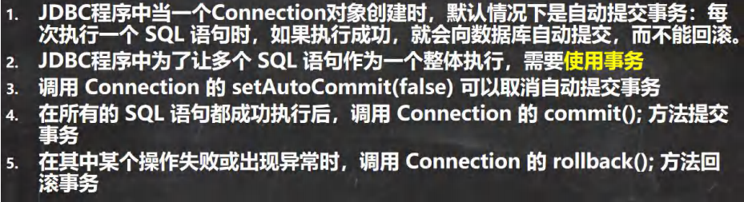
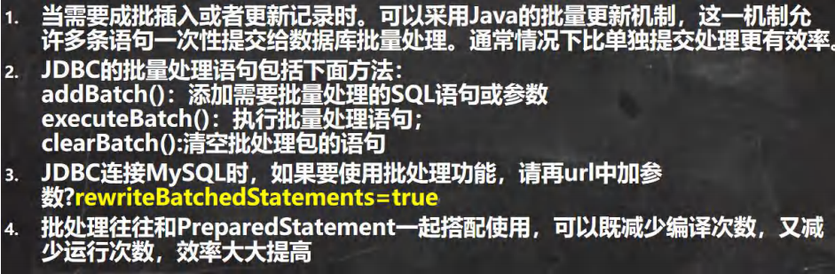
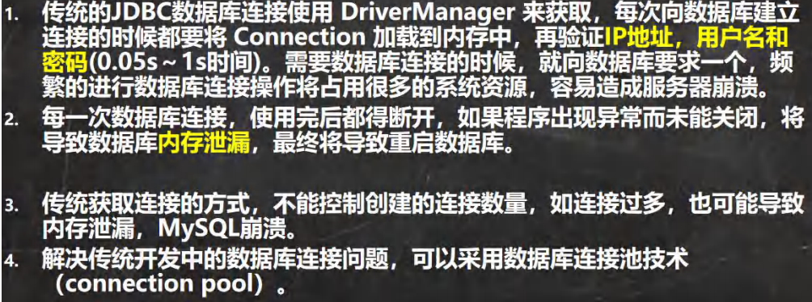
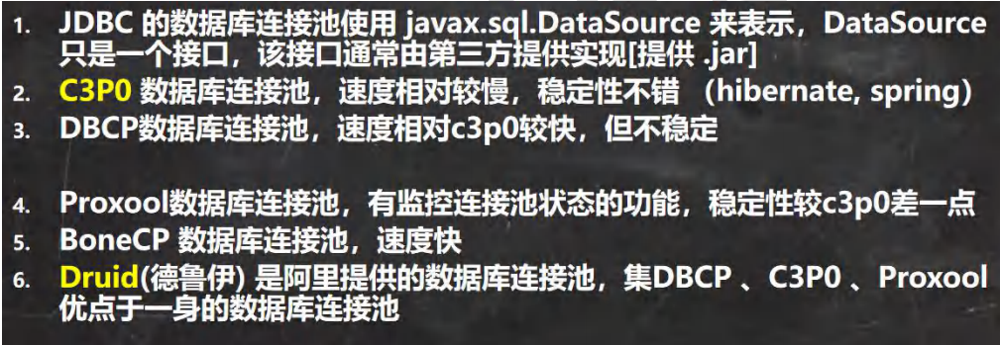
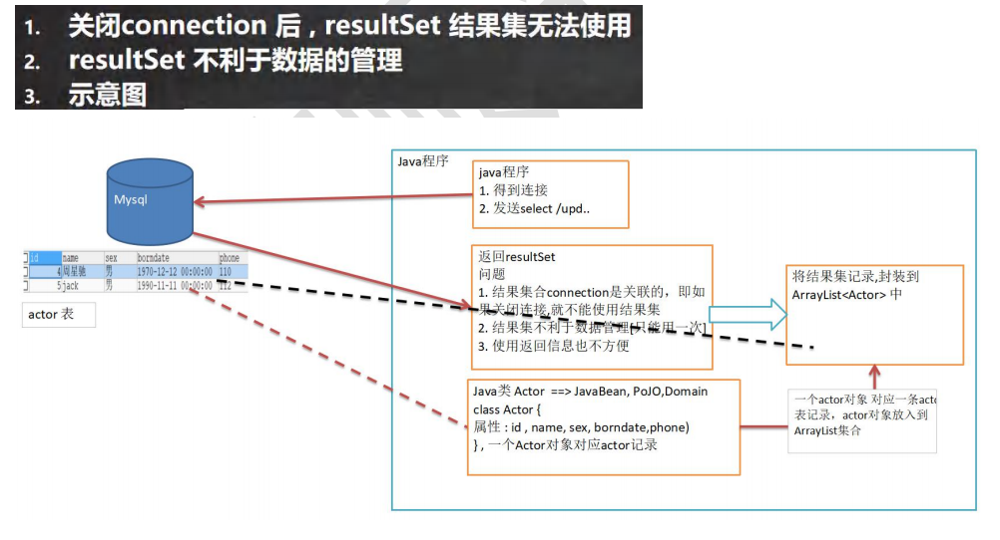
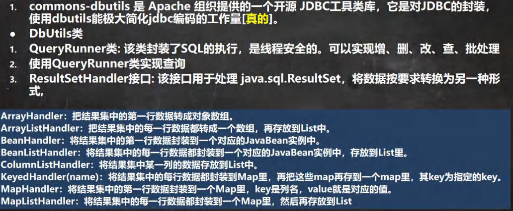
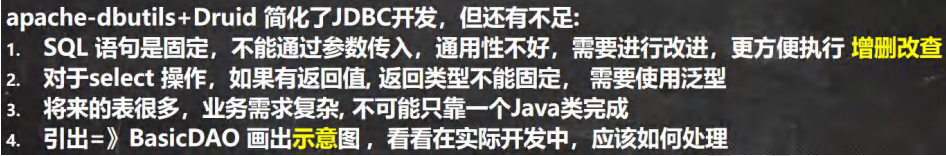
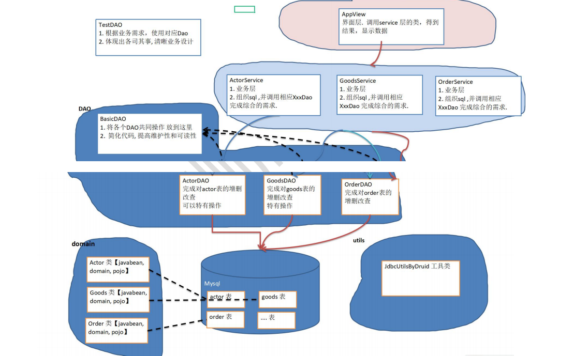
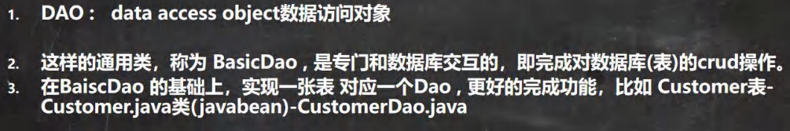

# JDBC
JDBC（Java Database Connectivity）是Java编程语言的一个标准API，用于与数据库进行连接、交互和操作。
它允许Java应用程序与各种关系型数据库系统（如MySQL、Oracle、SQL Server等）建立连接，执行SQL查询和更新操作，以及处理数据库事务

# jdbc快速入门
- 加载驱动
- 连接数据库
- 书写，执行sql语句
- 关闭连接
## jdbc连接数据库5种方式
第一种
```java
 public void fun1() throws SQLException {
        Driver driver = new Driver();
        String url = "jdbc:mysql://localhost:3306/db2";
        Properties properties = new Properties();
        properties.setProperty("user", "root");
        properties.setProperty("password", "bx_cha");
        Connection connect = driver.connect(url, properties);

        System.out.println("func2" + connect);
        connect.close();
    }
```
第二种
```java
public void fun2() throws Exception {
        //使用反射加载Driver
        Class<?> aClass = Class.forName("com.mysql.jdbc.Driver");

        // Object instance = aClass.newInstance();
        Driver driver = (Driver) aClass.newInstance();//实例化对象

        String url = "jdbc:mysql://localhost:3306/db2";
        Properties properties = new Properties();
        properties.setProperty("user", "root");
        properties.setProperty("password", "bx_cha");

        Connection connect = driver.connect(url, properties);
        System.out.println("func2" + connect);

        connect.close();
    }
```
第三种
```java
//方式3 使用DriverManager 替代 driver 进行统一管理
    public void fun3() throws Exception {

        //使用反射加载Driver
        Class<?> aClass = Class.forName("com.mysql.jdbc.Driver");
        Driver driver = (Driver) aClass.newInstance();

        //创建url 和 user 和 password
        String url = "jdbc:mysql://localhost:3306/db2";
        Properties properties = new Properties();
        properties.setProperty("user", "root");
        properties.setProperty("password", "bx_cha");

        DriverManager.registerDriver(driver);//注册Driver驱动

        Connection connection = DriverManager.getConnection(url, properties);
        System.out.println("第三种方式=" + connection);
        connection.close();
    }
```
第四种
```java
//方式4: 使用Class.forName 自动完成注册驱动，简化代码
    //这种方式获取连接是使用的最多，推荐使用
    @Test
    public void fun4() throws ClassNotFoundException, SQLException {
        //使用反射加载了 Driver类
        //在加载 Driver类时，完成注册
        /*
            源码: 1. 静态代码块，在类加载时，会执行一次.
            2. DriverManager.registerDriver(new Driver());
            3. 因此注册driver的工作已经完成
            static {
                try {
                    DriverManager.registerDriver(new Driver());
                } catch (SQLException var1) {
                    throw new RuntimeException("Can't register driver!");
                }
            }
         */
        Class.forName("com.mysql.jdbc.Driver");

        //创建url 和 user 和 password
        String url = "jdbc:mysql://localhost:3306/db2";
        String user = "root";
        String password = "bx_cha";
        Connection connection = DriverManager.getConnection(url, user, password);

        System.out.println("第四种方式=" + connection);
        connection.close();
    }
```
第五种(最常用的一种)
```java
//方式5 , 在方式4的基础上改进，增加配置文件，让连接mysql更加灵活
    @Test
    public void fun5() throws IOException, ClassNotFoundException, SQLException {

        //通过Properties对象获取配置文件的信息
        Properties properties = new Properties();
        properties.load(new FileInputStream("src\\mysql.properties"));

        //获取相关的值
        String driver = properties.getProperty("driver");
        String url = properties.getProperty("url");
        String user = properties.getProperty("user");
        String password = properties.getProperty("password");

        Class.forName(driver);//建议写上

        Connection connection = DriverManager.getConnection(url, user, password);

        System.out.println("方式5 " + connection);
        connection.close();
    }
```

# ResultSet 结果集
ResultSet 是 JDBC 中的一个重要接口，用于表示从数据库查询操作返回的结果集，它允许你迭代和检索查询结果中的数据行
## 简单使用
- dql使用statement.executeQuery
```java
ResultSet resultSet = statement.executeQuery("SELECT * FROM employees");
while (resultSet.next()) {
    // 处理当前行的数据
    int empId = resultSet.getInt("employee_id");
    String empName = resultSet.getString("employee_name");
    // ...
}
```
- dml使用statement.executeUpdate
```java
 ResultSet resultSet = statement.executeUpdate("insert 或者 delete 或者 update语句")
while (resultSet.next()) {
    // 处理当前行的数据
    int empId = resultSet.getInt("employee_id");
    String empName = resultSet.getString("employee_name");
    // ...
}
```
## 注意
要谨慎处理 ResultSet，确保在使用完之后及时关闭，以防止资源泄漏。另外，ResultSet 是一个只读的结果集，通常不支持对数据库进行更新操作。
## ResuleSet方法
- next() 向下一行移动，同时如果没有下一行，没有返回false
- previous() 向上一行移动，同时如果没有下一行，没有返回false
- getXxx(“列名 或者 索引”) 返回对应列的值，类型是Xxx
- getObject(“列名 或者 索引”) 返回对应列的值，类型是Object 可以接收对象

# Statement
## Statement
- statement.executeQuery 执行dql，返回resultSet结果集
- statement.executeUpdate 执行dml 返回影响行数
- statement.execute 执行任意sql，返回布尔值

## PreparedStatement
- preparedStatement.executeQuery 执行dql，返回resultSet结果集
- preparedStatement.executeUpdate 执行dml 返回影响行数
- preparedStatement.execute 执行任意sql，返回布尔值
- preparedStatement.setXxx(占位符索引，值)给占位符？赋值
- preparedStatement.setObject(占位符索引，值) 给占位符？赋值，可以传入对象

## Statement注意事项
Statement 是 JDBC 中的一个接口，它用于执行 SQL 语句（如查询、更新、插入、删除等）与数据库进行交互。在 JDBC 中，有三种类型的 Statement，它们用于不同的用途：

- Statement：Statement 是最基本的 SQL 执行接口，用于执行静态 SQL 语句。它通常用于执行不带参数的 SQL 查询和更新操作。但要注意，Statement 存在 SQL 注入的风险，因为它不会对参数进行预编译，应该谨慎使用
```java
Statement statement = connection.createStatement();
ResultSet resultSet = statement.executeQuery("SELECT * FROM employees");
```
- PreparedStatement：PreparedStatement 是用于执行带参数的 SQL 语句的接口，它预编译 SQL 语句，可以提高性能和安全性。通过 ? 占位符传递参数，避免了 SQL 注入问题。
```java
PreparedStatement preparedStatement = connection.prepareStatement("SELECT * FROM employees WHERE emp_id = ?");
preparedStatement.setInt(1, empId);
ResultSet resultSet = preparedStatement.executeQuery();
```
- CallableStatement：CallableStatement 用于调用存储过程（Stored Procedure）或函数（Function）的接口。它可以包含 IN、OUT 和 INOUT 参数，用于与数据库中的存储过程进行交互
```java
CallableStatement callableStatement = connection.prepareCall("{call getEmployeeDetails(?, ?)}");
callableStatement.setInt(1, empId);
callableStatement.registerOutParameter(2, Types.VARCHAR); // 注册OUT参数
callableStatement.execute();
String employeeName = callableStatement.getString(2); // 获取OUT参数的值
```
# 封装JdbcUtils[连接和关闭连接]
```java
public class JDBCUtils {
    //定义相关的属性(4个), 因为只需要一份，因此，我们做出static
    private static String user; //用户名
    private static String password; //密码
    private static String url; //url
    private static String driver; //驱动名

    //在static代码块去初始化
    static {
        try {
            Properties properties = new Properties();
            properties.load(new FileInputStream("src\\mysql.properties"));

            //读取相关的属性值
            user = properties.getProperty("user");
            password = properties.getProperty("password");
            url = properties.getProperty("url");
            driver = properties.getProperty("driver");

        } catch (IOException e) {
            //在实际开发中，我们可以这样处理
            //1. 将编译异常转成 运行异常
            //2. 调用者，可以选择捕获该异常，也可以选择默认处理该异常，比较方便.
            throw new RuntimeException(e);
        }
    }


    //连接数据库, 返回Connection
    public static Connection getConnection() {

        try {
            return DriverManager.getConnection(url, user, password);
        } catch (SQLException e) {
            //1. 将编译异常转成 运行异常
            //2. 调用者，可以选择捕获该异常，也可以选择默认处理该异常，比较方便.
            throw new RuntimeException(e);
        }
    }

    //关闭相关资源
    /*
        1. ResultSet 结果集
        2. Statement 或者 PreparedStatement
        3. Connection
        4. 如果需要关闭资源，就传入对象，否则传入 null
     */
    public static void close(ResultSet set, PreparedStatement statement, Connection connection) {

        //判断是否为null
        try {
            if (set != null) {
                set.close();
            }
            if (statement != null) {
                statement.close();
            }
            if (connection != null) {
                connection.close();
            }
        } catch (SQLException e) {
            //将编译异常转成运行异常抛出
            throw new RuntimeException(e);
        }

    }
}
```
# 事务

# 批处理


## 参数 rewriteBatchedStatements=true
```text
driver=com.mysql.jdbc.Driver
url=jdbc:mysql://localhost:3306/db2?rewriteBatchedStatements=true
user=root
password=bx_cha
```
# 连接池
## 5k 次连接数据库问题
```java
public void testCon() {
    //看看连接-关闭 connection 会耗用多久
    
    long start = System.currentTimeMillis();
    System.out.println("开始连接.....");
    
        for (int i = 0; i < 5000; i++) {
        //使用传统的 jdbc 方式，得到连接
        Connection connection = JDBCUtils.getConnection();
        //做一些工作，比如得到 PreparedStatement ，发送 sql
        //.......... //关闭
        JDBCUtils.close(null, null, connection);
    }
    long end = System.currentTimeMillis();
    System.out.println("传统方式 5000 次 耗时=" + (end - start));//传统方式 5000 次 耗时=7099
}
```
## 传统获取 Connection 问题分析

## 数据库连接池种类

## C3P0演示
```java
//方式1： 相关参数，在程序中指定user, url , password等
    @Test
    public void testC3P0_01() throws Exception {

        //1. 创建一个数据源对象
        ComboPooledDataSource comboPooledDataSource = new ComboPooledDataSource();

        //通过Properties对象获取配置文件的信息
        Properties properties = new Properties();

        properties.load(new FileInputStream("src\\mysql.properties"));

        //获取相关的值
        String driver = properties.getProperty("driver");
        String url = properties.getProperty("url");
        String user = properties.getProperty("user");
        String password = properties.getProperty("password");

        //给数据源 comboPooledDataSource 设置相关的参数
        //注意：连接管理是由 comboPooledDataSource 来管理
        comboPooledDataSource.setDriverClass(driver);
        comboPooledDataSource.setJdbcUrl(url);
        comboPooledDataSource.setUser(user);
        comboPooledDataSource.setPassword(password);

        //设置初始化连接数
        comboPooledDataSource.setInitialPoolSize(10);
        //最大连接数
        comboPooledDataSource.setMaxPoolSize(50);

        long start = System.currentTimeMillis();
        for (int i = 0; i < 5000; i++) {
            Connection connection = comboPooledDataSource.getConnection(); //这个方法就是从 DataSource 接口实现的
            //System.out.println("连接OK");
            connection.close();
        }
        long end = System.currentTimeMillis();

        // c3p0 5000连接mysql 耗时=646
        System.out.println("c3p0 5000连接mysql 耗时=" + (end - start));

    }
```
```java
//第二种方式 使用配置文件模板来完成

    //1. 将c3p0 提供的 c3p0.config.xml 拷贝到 src目录下
    //2. 该文件指定了连接数据库和连接池的相关参数
    @Test
    public void testC3P0_02() throws SQLException {
        ComboPooledDataSource comboPooledDataSource = new ComboPooledDataSource("bx_cha_Mysql");

        //测试5000次连接mysql
        long start = System.currentTimeMillis();

        System.out.println("开始执行....");
        for (int i = 0; i < 5000; i++) {
            Connection connection = comboPooledDataSource.getConnection();
            //System.out.println("连接OK~");
            connection.close();
        }

        long end = System.currentTimeMillis();
        //c3p0的第二种方式 耗时=413
        System.out.println("c3p0的第二种方式(5000) 耗时=" + (end - start));//478
    }
```
# Druid(德鲁伊)演示
```java
 public void testDruid() throws Exception {
        //1. 加入 Druid jar包
        //2. 加入 配置文件 druid.properties , 将该文件拷贝项目的src目录
        //3. 创建Properties对象, 读取配置文件
        Properties properties = new Properties();
        properties.load(new FileInputStream("src\\druid.properties"));

        //4. 创建一个指定参数的数据库连接池, Druid连接池
        DataSource dataSource = DruidDataSourceFactory.createDataSource(properties);

        long start = System.currentTimeMillis();
        for (int i = 0; i < 500000; i++) {
            Connection connection = dataSource.getConnection();
            // System.out.println(connection.getClass());
            //System.out.println("连接成功!");
            connection.close();
        }
        long end = System.currentTimeMillis();
        //druid连接池 操作5000 耗时=412
        System.out.println("druid连接池 操作500000 耗时=" + (end - start));//539
    }
```
# Apache—DBUtils
## 问题

## 使用

- ArrayHandler：将结果集的第一行映射为一个数组。
- ArrayListHandler：将结果集的每一行映射为一个数组，并将这些数组放入列表中。
- BeanHandler：将结果集的第一行映射为一个 Java Bean 对象。
- BeanListHandler：将结果集的每一行映射为一个 Java Bean 对象，并将这些对象放入列表中。
- ColumnListHandler：将结果集的某一列映射为列表。
- KeyedHandler：将结果集的每一行映射为一个 Map，并将这些 Map 放入列表中。
- MapHandler：将结果集的第一行映射为一个 Map。
- MapListHandler：将结果集的每一行映射为一个 Map，并将这些 Map 放入列表中。
- ScalarHandler：用于从单个查询中检索标量值（单个值）
# DAO 和增删改查通用方法-BasicDao


## 基本说明

## BasicDAO 应用实例

