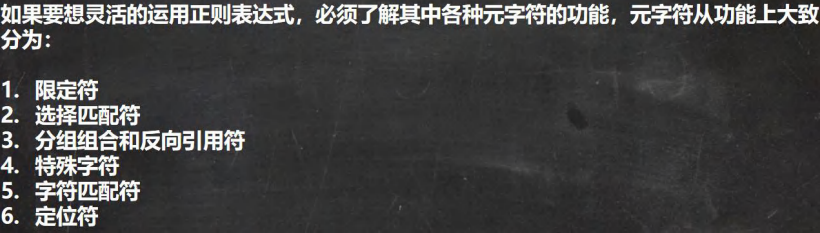
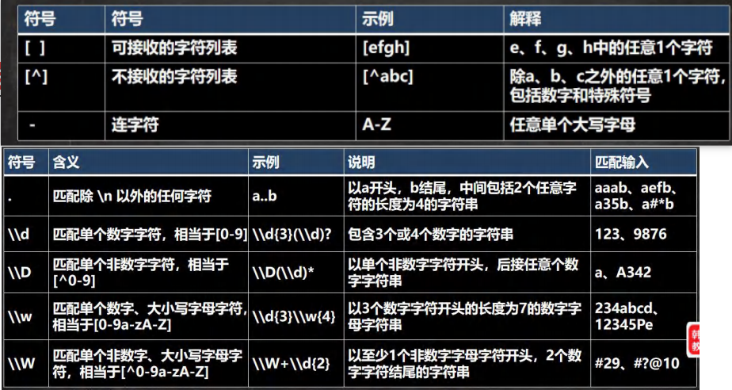
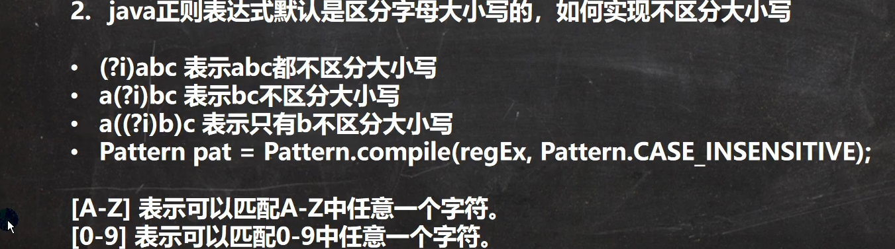
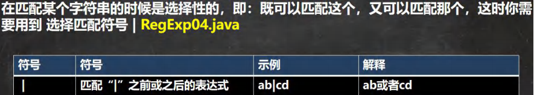
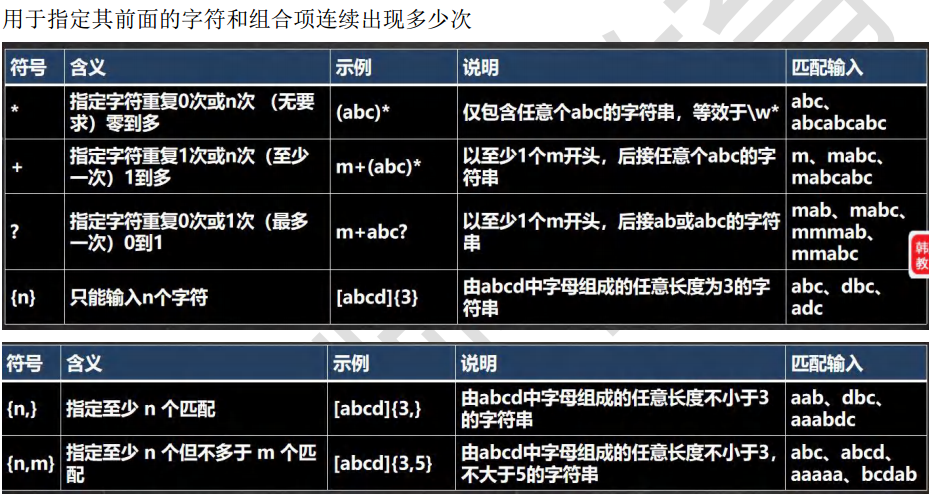
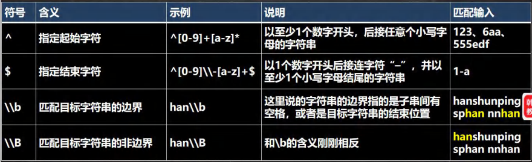
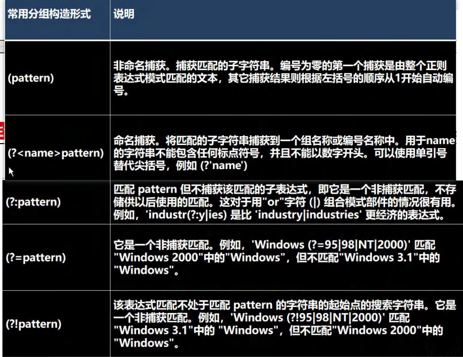
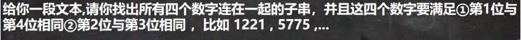
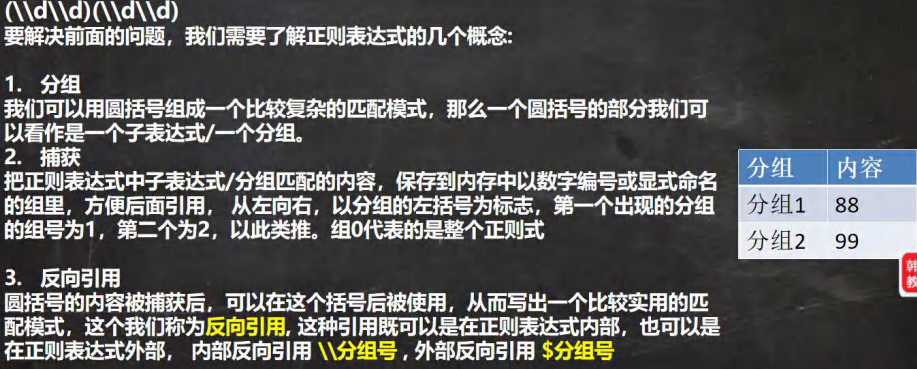

# 正则表达式

# 基本语法
## 基本介绍


## 元字符(Metacharacter)-转义号 \\
在java当中 \\ 代表其他语言当中的一个\
## 常见的转义字符
正则表达式当中需要转义字符的字符有 . * + () $ / \ ? [] ^ {} -

## 元字符-字符匹配符

```txt
- 的使用

String regStr = "\\d{5}-(\\d)\\1{2}(\\d)\\2{2}(\\d)\\3{2}";

String regStr="[a-z]"

在正则表达式中，要判断 - 是否表示字符范围还是连字符，通常取决于 - 的上下文以及它周围的字符。以下是一些判断的基本规则：

在字符类 [...] 内部：如果 - 出现在字符类（方括号）内部，通常它被解释为字符范围的一部分。
例如，[a-z] 表示匹配小写字母 'a' 到 'z' 之间的任何一个字符。但要注意，如果 - 出现在字符类的开头或结尾，它通常被解释为字面的连字符。

在字符类外部：如果 - 出现在字符类之外，它通常被解释为字面的连字符。
例如，a-z 在正则表达式模式中不在字符类内，因此 - 被解释为字面的连字符。

转义：如果你希望将 - 视为字面的连字符而不是字符范围的一部分，你可以在 - 前面加上反斜杠 \ 来转义它，如 a\-z。

总之，要判断 - 的意义，需要考虑它在正则表达式中的位置以及它周围的字符。根据上下文，你可以确定 - 是否表示字符范围还是字面的连字符
```
## 如何不区分大小写

## 元字符-选择匹配符


## 元字符-限定符

## 元字符-定位符
定位符, 规定要匹配的字符串出现的位置，比如在字符串的开始还是在结束的位置，

## 分组

# 常用类
正则表达式三个常用类

# 分组 捕获 反向引用
## 提出需求

## 分组 捕获 反向引用

# String类中使用正则表达式

## 替换功能
StringReg.java
String 类 public String replaceAll(String regex,String replacement)
## 判断功能
String 类 public boolean matches(String regex){} //使用 Pattern 和 Matcher 类
## 分割功能
String 类 public String[] split(String regex)